# Brooks-Lint Review

**Mode:** Architecture Audit
**Scope:** StoryMoss (草苔) v0.22.4 全项目 — Rust 后端 (`src-tauri/src`)、前端 (`src-frontend/src`)、模板与资产 (`templates/`)
**Health Score:** 18/100

项目核心架构存在严重的层间循环依赖：约半数后端模块构成一个巨型强连通分量，数据层反向依赖领域层，生成/记忆/编排层彼此纠缠，导致变更传播半径过大、单元测试困难、核心子系统难以独立演化。

---

## Module Dependency Graph

```mermaid
graph TD
    subgraph UI
        Frontend
    end

    subgraph Command
        commands["commands (fan-out: 13)"]
    end

    subgraph Orchestration
        agents["agents (fan-out: 14)"]
        pipeline
        task_system
        scene_commands["scene_commands (fan-out: 10)"]
    end

    subgraph CreativeDomain
        creative_engine["creative_engine (fan-out: 12)"]
        narrative
        story_system
        memory
        reading_power
        audit
        anti_ai
        canonical_state
        versions
    end

    subgraph Intelligence
        planner
        intention_graph
        strategy
        skills
        prompts
        llm
        model_gateway
        capabilities
        mcp
    end

    subgraph ContentIngest
        book_deconstruction["book_deconstruction (fan-out: 9)"]
        knowledge_base
        embeddings
        vector
    end

    subgraph Infrastructure
        db["db (imports narrative)"]
        config
        auth
        router
        subscription
        state_sync
        utils["utils / events / export / window / error / logging / telemetry / workflow / automation"]
    end

    Frontend --> commands
    commands --> creative_engine
    commands --> narrative
    commands --> story_system
    commands --> memory
    commands --> db
    commands --> llm
    commands --> strategy
    commands --> book_deconstruction
    commands --> pipeline
    commands --> vector
    commands --> embeddings
    commands --> skills
    commands --> export
    commands --> mcp
    commands --> router

    agents --> creative_engine
    agents --> memory
    agents --> story_system
    agents --> prompts
    agents --> db
    agents --> llm
    agents --> router
    agents --> task_system
    agents --> state_sync
    agents --> subscription

    creative_engine --> agents
    creative_engine --> memory
    creative_engine --> pipeline
    creative_engine --> story_system
    creative_engine --> task_system
    creative_engine --> db
    creative_engine --> llm
    creative_engine --> router

    narrative --> creative_engine
    narrative --> memory
    narrative --> story_system
    narrative --> strategy
    narrative --> db
    narrative --> llm
    narrative --> router

    story_system --> creative_engine
    story_system --> memory
    story_system --> db
    story_system --> llm
    story_system --> vector
    story_system --> router
    story_system --> automation
    story_system --> state_sync

    memory --> agents
    memory --> db
    memory --> llm
    memory --> narrative
    memory --> vector
    memory --> router

    pipeline --> creative_engine
    pipeline --> story_system
    pipeline --> task_system
    pipeline --> db
    pipeline --> llm
    pipeline --> router
    pipeline --> subscription

    planner --> intention_graph
    planner --> llm
    planner --> capabilities
    planner --> db
    planner --> router

    intention_graph --> planner
    intention_graph --> strategy
    intention_graph --> llm
    intention_graph --> db
    intention_graph --> capabilities

    strategy --> creative_engine
    strategy --> skills
    strategy --> workflow
    strategy --> llm
    strategy --> db
    strategy --> router

    book_deconstruction --> narrative
    book_deconstruction --> llm
    book_deconstruction --> vector
    book_deconstruction --> embeddings
    book_deconstruction --> task_system
    book_deconstruction --> db
    book_deconstruction --> router
    book_deconstruction --> subscription

    task_system --> book_deconstruction
    task_system --> reading_power
    task_system --> db
    task_system --> llm
    task_system --> router
    task_system --> state_sync

    llm --> memory
    llm --> db
    llm --> config
    llm --> router
    llm --> events

    db --> narrative
    db -.->|cycle| narrative

    classDef critical fill:#ff6b6b,stroke:#c92a2a,color:#fff
    classDef warning fill:#ffd43b,stroke:#e67700
    classDef clean fill:#51cf66,stroke:#2b8a3e,color:#fff

    class agents,creative_engine,memory,narrative,db,planner,intention_graph critical
    class commands,scene_commands,story_system,pipeline,book_deconstruction,task_system,llm,strategy warning
    class Frontend,reading_power,audit,anti_ai,canonical_state,versions,skills,prompts,model_gateway,capabilities,mcp,knowledge_base,embeddings,vector,config,auth,router,subscription,state_sync,utils clean
```

---

## Findings

### 🔴 Critical

**Dependency Disorder — 20 模块构成单一强连通分量（Mega-SCC）**
Symptom: 对 `src-tauri/src` 进行 Tarjan 强连通分量分析后发现，`agents`、`automation`、`book_deconstruction`、`canonical_state`、`config`、`creative_engine`、`db`、`intent`、`llm`、`memory`、`narrative`、`pipeline`、`prompts`、`reading_power`、`router`、`skills`、`story_system`、`strategy`、`subscription`、`task_system` 20 个模块彼此循环引用，几乎无法拆分。
Source: Robert C. Martin — Clean Architecture, Acyclic Dependencies Principle (ADP)
Consequence: 任一模块的接口变更都可能触发不可预知的重新编译与回归测试范围扩大；合同、记忆、生成引擎等核心域无法独立单元测试或独立发布，任何局部重构都会牵动整个应用核心。
Remedy: 按 Clean Architecture 重划层级：将纯数据类型（Domain Entities / DTOs）抽到独立的 `domain` 或 `types` 模块，使 `db`、`narrative`、`creative_engine`、`agents`、`memory` 只依赖类型而非互相引用；明确依赖方向 UI → Commands → Orchestration → Domain → Data。

**Dependency Disorder — 数据层反向依赖领域层（db → narrative）**
Symptom: `src-tauri/src/db/repositories_narrative.rs` 通过 `use crate::narrative::elements::*;` 直接导入叙事领域类型。
Source: Robert C. Martin — Clean Architecture, Dependency Inversion Principle (DIP)
Consequence: 领域层迭代会强制数据层重新编译；无法在不修改仓库的情况下替换叙事模型；数据层成为领域变更的传播放大器，严重违反“稳定层不应依赖不稳定层”的原则。
Remedy: 在 `db::models` 或独立的 `domain::narrative_elements` 中定义 narrative 相关的持久化/领域类型，让 `db` 只依赖该中性模块，禁止 `db` 导入 `narrative` 子模块。

**Dependency Disorder — 双向耦合：creative_engine ↔ agents 与 memory ↔ agents**
Symptom: `creative_engine/workflow/engine.rs` 导入 `agents` 的执行器类型；`agents/orchestrator.rs`、`context_optimizer.rs` 导入 `creative_engine` 的上下文构建与引擎。`memory/mod.rs` 导入 `agents::AgentContext`，`agents/mod.rs` 导入 `memory::orchestrator::MemoryPack`。
Source: John Ousterhout — A Philosophy of Software Design, Information Leakage
Consequence: 生成引擎与编排层、记忆与编排层互相暴露内部设计决策；修改 `AgentContext` 字段需要同时修改 `memory` 和 `agents`；抽象边界被穿透，知识在多个模块中重复编码。
Remedy: 在 `creative_engine` 和 `memory` 层定义 `ContextProvider`、`MemoryPort` trait，由 `agents` 层实现并注入；或将共享数据结构（`AgentContext`、`MemoryPack`）迁移到独立的 `agent_types` 模块，切断循环依赖。

**Dependency Disorder — intention_graph 与 planner 循环依赖**
Symptom: `intention_graph/planner.rs` 导入 `crate::planner::{ExecutionPlan, PlanContext, PlanGenerator}`，而 `planner/executor.rs` 导入 `intention_graph::IntentionGraphPlanner`。
Source: Robert C. Martin — Clean Architecture, Acyclic Dependencies Principle (ADP)
Consequence: 意图图调度与计划执行无法独立演化；任何一侧的 API 变更都会传导到另一侧；命名上的重叠暗示两个“Planner”概念已经纠缠，增加了认知负担。
Remedy: 将 `IntentionGraphPlanner` 抽象为 `planner` 层可消费的 `PlanStrategy` trait，或把意图图计划逻辑整体合并到 `planner` 模块并反转依赖，确保 `intention_graph` 只被 `planner` 单向调用。

### 🟡 Warning

**Dependency Disorder — 编排层模块扇出过高**
Symptom: `agents` 扇出 14，`commands` 扇出 13，`creative_engine` 扇出 12，`scene_commands` 扇出 10。这些模块同时协调 UI、领域、数据、LLM、向量、事件、订阅等多个维度。
Source: Steve McConnell — Code Complete, Ch. 7: High-Quality Routines
Consequence: 这些模块成为变更热点和回归测试瓶颈；一个小的需求改动（如新增一种追读力债务类型）可能需要在 10+ 个模块中同步修改，Shotgun Surgery 风险极高。
Remedy: 引入 Mediator/编排器模式，将命令层收敛为按领域划分的薄门面；把 `agents` 中的提示词组装、上下文加载、LLM 调用拆分为独立子模块（如 `prompt_assembler`、`context_loader`、`llm_dispatcher`），降低单个模块的协调范围。

**Accidental Complexity — 骨架模块与占位实现**
Symptom: `story_system/contract_builder.rs` 是空壳结构；`reading_power/evaluator.rs` 仅有 3 行注释；`SceneCommitService::auto_commit` 用 `"{}"` 占位 `review_result_json`、`fulfillment_result_json`、`accepted_events_json`、`state_deltas_json`、`entity_deltas_json`；`audit/opening_clarity.rs` 明确注释“未接入生产”。
Source: Frederick Brooks — The Mythical Man-Month, Ch. 5: The Second-System Effect
Consequence: 合同、追读力、审计等 Story System 子系统虽然表结构和接口已落地，但核心算法与真实数据流缺失，导致“框架已通、内容待填”，维护者难以判断哪些功能是激活的，增加了返工成本和认知负担。
Remedy: 删除或填充空壳：为 `contract_builder` 实现真实构建逻辑，补齐 `evaluator.rs` 的 hook / coolpoint / micropayoff 提取，将 `OpeningClarityGate` 接入 `AuditService`，移除 `auto_commit` 中的占位 JSON，确保提交链携带真实评审与履约数据。

**Domain Model Distortion — 全局单例与贫血模型**
Symptom: `lib.rs` 使用全局 `DB_POOL`、`APP_CONFIG`、`SKILL_MANAGER`；业务逻辑大量位于 `agents/service.rs`、`story_system/mod.rs`、`creative_engine/context_builder.rs` 等服务/组装层；`db::models` 中的实体主要为 getter/setter 的数据结构。
Source: Eric Evans — Domain-Driven Design, Anemic Domain Model
Consequence: 领域规则分散在大量服务函数中，难以单元测试；全局状态使并行测试和 mock 替换困难；新增开发者难以判断业务规则应放在哪个模块，导致知识重复和边界侵蚀。
Remedy: 逐步将核心不变量（如 `RuntimeContract` 的约束校验、`SceneCommit` 的状态机、`ReadingPower` 的计分规则）下沉到领域对象；将全局单例改为 Tauri State 注入或构造函数注入，新代码禁止直接调用 `get_pool()`。

**Testability Seam Assessment — 基础设施边界缺乏可注入 seams**
Symptom: `DB_POOL`、`APP_CONFIG`、`SKILL_MANAGER` 为全局 `OnceLock`/`OnceCell`；`llm` 模块在多处直接通过全局状态构造 adapter；向量/embedding 依赖具体实现而非 trait。
Source: Michael Feathers — Working Effectively with Legacy Code, Ch. 4: The Seam Model
Consequence: 单元测试被迫使用真实数据库/LLM/向量服务，或需要繁琐的全局状态重置；测试运行慢且不稳定，开发者倾向于少写测试，进一步加剧架构腐化。
Remedy: 为 DB、LLM Adapter、VectorStore、EmbeddingProvider 定义 trait 并在 composition root 注入；将全局访问点收缩为兼容层，新代码禁止直接调用 `get_pool()`，已有调用逐步迁移。

### 🟢 Suggestion

**Cognitive Overload — 54 个顶层模块职责边界模糊**
Symptom: `src-tauri/src/lib.rs` 声明 43 个目录模块 + 11 个根模块，存在 `workflow` 与 `task_system`、两个 `planner` 概念（`planner` 与 `intention_graph/planner`）、`state_sync` 与 `subscription` 等职责重叠的命名。
Source: John Ousterhout — A Philosophy of Software Design, Deep Modules
Consequence: 新开发者难以判断功能应放入 `planner`、`task_system` 还是 `agents`；模块数量过多导致导航和认知负荷上升，增加变更时选错模块的概率。
Remedy: 编制模块职责清单（Module Charter），合并或重命名重叠模块（如将 `workflow` 并入 `task_system`，明确 `planner` 与 `intention_graph/planner` 的关系），确保每个模块能用一句话说明职责。

**Knowledge Duplication — 路由/任务类型被多层重复感知**
Symptom: `router::TaskType`、`Priority` 被 `creative_engine`、`narrative`、`llm`、`memory`、`pipeline` 等近 10 个业务模块直接导入，路由策略渗透进业务逻辑。
Source: Robert C. Martin — Clean Architecture, Stable Dependencies Principle (SDP)
Consequence: 路由策略的变更会横向传导到几乎所有业务模块；`router` 成为隐式公共依赖，增加了不稳定层向稳定层的反向依赖。
Remedy: 在编排层（`agents`/`commands`）统一消费 `router`，通过 `PlanContext`/`AgentContext` 将路由结果作为数据传给下层模块，避免业务模块直接依赖路由类型。

---

## Summary

StoryMoss v0.22.4 的功能迭代非常密集（Genesis、拆书、Story System、PromptRegistry、意图图等），但架构层正在承受快速增长带来的耦合压力。最紧迫的问题是 **20 模块强连通分量** 和 **数据层反向依赖领域层**，它们已经导致核心域无法独立演化。建议优先执行两项结构性改革：

1. **提取中性领域类型模块**，切断 `db ↔ narrative`、`creative_engine ↔ agents`、`memory ↔ agents` 的循环依赖；
2. **将全局基础设施访问点改为注入式 seams**，为 DB、LLM、向量存储引入 trait，使核心域能够脱离真实基础设施进行单元测试。

在完成层间解耦后，再逐步填充 `contract_builder`、`reading_power/evaluator`、OpeningClarityGate 等骨架模块，否则新功能会进一步加固现有循环依赖。
