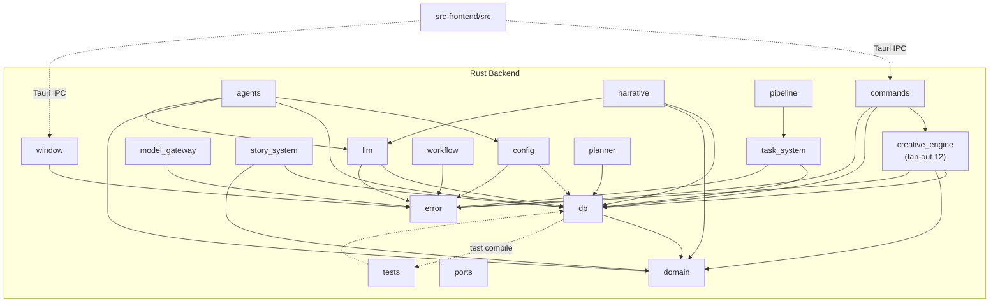

# Brooks-Lint Health Dashboard

**Mode:** Health Dashboard
**Scope:** StoryMoss（草苔）v0.26.28 → v0.26.29 热修复前基线 — /Users/yuzaimu/projects/StoryMoss 全项目
> 注：本扫描在 v0.26.29 文档/版本号提交前执行，代码功能与 v0.26.29 一致，仅版本元数据不同。
**Composite Score:** 78/100
**Trend:** 66 → 78 (+12) over last run

| Dimension | Score | Top Finding |
|-----------|-------|-------------|
| Code Quality (PR) | N/A — 无未提交变更 | 本次跳过 |
| Architecture | 85/100 | `commands/orchestrator.rs` 直接耦合 15+ 顶层模块，编排层扇出过宽 |
| Tech Debt | 65/100 | 两个核心编排函数分别超过 900 行，混合多阶段抽象 |
| Test Quality | 85/100 | E2E 依赖 200+ 行内联 mock script，核心编排函数缺少直接单测 |

> 说明：PR 维度因当前工作区无未提交变更而跳过，其权重 0.25 按健康指南动态重分配至 Architecture（0.40）、Tech Debt（0.33）、Test Quality（0.27）。

---

## Module Dependency Graph

---

## Top Findings (max 5 across all dimensions)

### 🔴 Critical

**Cognitive Overload — `commands/orchestrator.rs::smart_execute_inner` 长达 973 行**
- Symptom: `src-tauri/src/commands/orchestrator.rs` 中 `smart_execute_inner` 函数体 973 行，顺序包含上下文加载、意图解析、计划执行、多模型生成、事件发射、错误恢复、结果后处理等 7 个以上阶段；源码内出现 73 处 `crate::` 引用，跨越 `db`、`narrative`、`planner`、`llm`、`story_system`、`state_sync`、`intent` 等 15+ 顶层模块。
- Source: McConnell — *Code Complete* (Ch. 7: High-Quality Routines); Fowler — *Refactoring* (Long Method)
- Consequence: 任一阶段的行为调整都需要在 973 行内定位，回归测试难以覆盖阶段组合，新开发者不敢重构，小功能补丁会不断扩大函数体积。
- Remedy: 按阶段提取为 `load_smart_context`、`resolve_intent`、`execute_plan_with_events` 等独立函数/小模块，让 `smart_execute_inner` 退化为 50 行以内的编排骨架。

**Cognitive Overload — `agents/orchestrator.rs::execute_trishot` 长达 896 行**
- Symptom: `src-tauri/src/agents/orchestrator.rs` 中 `execute_trishot` 函数体 896 行，同时处理 tri-shot 预热、模型选择、三次生成调度、结果合并、后处理与重试/回退策略，且与 `execute_full`（423 行）共享大量重复逻辑。
- Source: Fowler — *Refactoring* (Long Method); McConnell — *Code Complete* (Ch. 7)
- Consequence: 重试策略与生成逻辑纠缠，无法单独测试一次生成尝试，修复重复/截断类 bug 时容易在 896 行中引入副作用。
- Remedy: 将三次生成抽象为 `GenerationAttempt` 策略对象，提取 `select_models`、`merge_trishot_results`、`apply_retry_policy`，使每个函数只表达单一决策。

### 🟡 Warning

**Dependency Disorder — `creative_engine` 顶层扇出达 12**
- Symptom: `src-tauri/src/creative_engine/mod.rs` 下辖 19 个子模块，顶层 `creative_engine` 对外依赖 `anti_ai`、`db`、`domain`、`error`、`impact_analyzer`、`memory`、`registry`、`repository`、`rewrite_engine`、`strategy` 等 12 个模块，超过Dependency Disorder 建议的 5 个扇出阈值。
- Source: Martin — *Clean Architecture* (Stable Dependencies Principle / Acyclic Dependencies Principle); Hunt & Thomas — *The Pragmatic Programmer* (Ch. 5: Decoupling and the Law of Demeter)
- Consequence: 任何被依赖模块的接口变化都会直接波及创意引擎核心，导致该高变更区域难以独立演进，单元测试必须拉起大量依赖。
- Remedy: 将 `creative_engine` 拆分为 `creative_engine_core`（纯策略，仅依赖 `domain`/`ports`）与 `creative_engine_adapters`（依赖具体模块），核心策略通过端口与外界交互。

**Test Brittleness — E2E 使用 200+ 行内联 mock script（Mystery Guest）**
- Symptom: `e2e/genesis-duplicate.spec.ts` 内嵌 `getGenesisMockScript` 工厂超过 200 行，自行构造 story、chapter、settings、listeners、invoke 路由等全部依赖，mock 代码量超过测试断言数倍。
- Source: Meszaros — *xUnit Test Patterns* (Mystery Guest); Osherove — *The Art of Unit Testing* (Test isolation principle)
- Consequence: mock 与生产 IPC 契约隐性耦合，接口字段一旦变化，E2E 在运行时以难以诊断的方式失败；维护者无法从测试名看出被测行为，修改成本高。
- Remedy: 将 mock 工厂提取到 `e2e/fixtures/genesis-mock.ts`，显式声明其满足的 IPC 契约版本，测试只注入必要变体。

**Coverage Illusion — 核心编排函数缺少直接单元测试**
- Symptom: `smart_execute_inner`（973 行）、`execute_trishot`（896 行）、`execute_generation`（632 行）均无直接单元测试；现有 672 个 Rust 测试主要分布在 repository、domain、utils 等稳定层，orchestrator 层依赖集成/E2E 路径覆盖。
- Source: Feathers — *Working Effectively with Legacy Code* (legacy code is code without tests); Google — *How Google Tests Software* (change coverage vs line coverage)
- Consequence: 高变更风险区域（智能创作入口）缺乏变更保护，回归只能依靠 E2E/集成测试，反馈慢且定位粗，bug 修复容易反复。
- Remedy: 为 orchestrator 引入基于内存 db 与 fake LLM 的 seam，补写 characterization tests 刻画当前行为，再逐步提取可单元测试的策略对象。

---

## Recommendation

当前项目最需关注的是 **Tech Debt** 维度的两个超 900 行核心编排函数；它们同时恶化了 Architecture 维度的扇出和 Test 维度的可测试性。建议优先对 `commands/orchestrator.rs::smart_execute_inner` 做阶段拆分，这会是后续改善架构耦合与补全单元测试的共同前置条件。Architecture 得分 85 说明全局依赖方向已相对健康（domain 无业务导入、architecture_guard 通过、全局单例已清理），但 `creative_engine` 与 `commands/orchestrator.rs` 仍是扇出热点。Test 维度中 E2E mock 工厂化和核心 orchestrator 单测补齐应排入下一迭代。建议对 Tech Debt 维度单独运行完整版 `brooks-lint/tech-debt` skill，以获取针对 R1–R6 更细粒度的修复清单。
