# StoryForge 项目流程图技术文档

> **版本**：v0.22.4（草苔）  
> **最后更新**：2026-06-21  
> **文档定位**：面向架构师/核心开发者的技术流程全景图，覆盖创世、拆书、智能创作主路径、79+ 提示词、43 个网文题材模板、40+ 创意资产、Story System 合同/提交链/追读力/审计/记忆等子系统。  
> **相关文档**：`ARCHITECTURE.md`、`docs/BROOKS_LINT_ARCHITECTURE_AUDIT_v0.22.4.md`、`docs/CREATIVE_ASSETS_AUDIT_v0.22.4.md`

---

## 目录

1. [系统总览图](#1-系统总览图)
2. [创世 Genesis 流程](#2-创世-genesis-流程)
3. [拆书 Book Deconstruction 流程](#3-拆书-book-deconstruction-流程)
4. [智能创作主路径](#4-智能创作主路径)
5. [Story System 合同/提交链/追读力闭环](#5-story-system-合同提交链追读力闭环)
6. [叙事分析/活跃线索/深度洞察生成与消费](#6-叙事分析活跃线索深度洞察生成与消费)
7. [PromptRegistry + 网文模板 + 方法论注入流程](#7-promptregistry--网文模板--方法论注入流程)
8. [数据持久化与同步总览](#8-数据持久化与同步总览)
9. [前端双界面编排流程](#9-前端双界面编排流程)
10. [核心资产清单](#10-核心资产清单)

---

## 1. 系统总览图

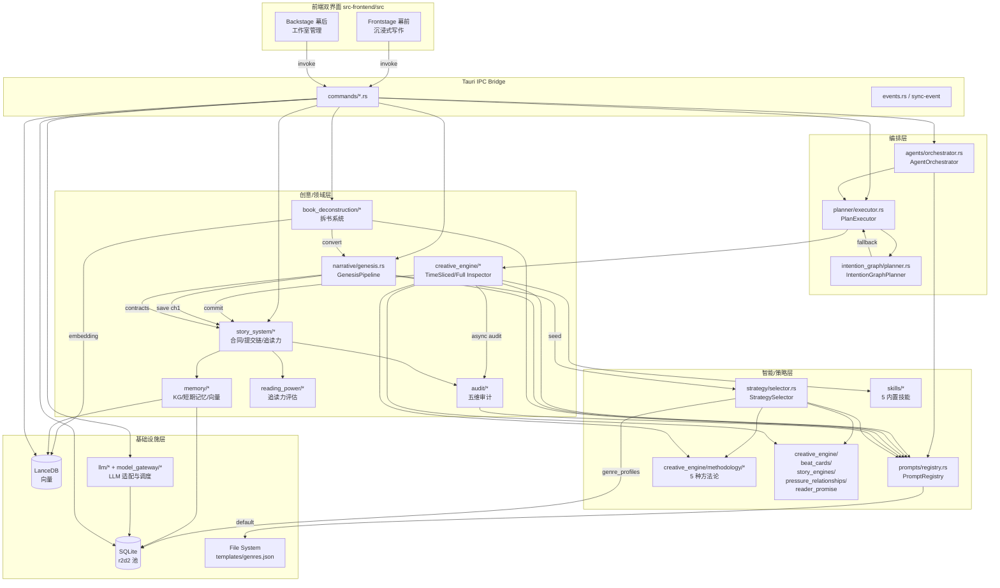
```mermaid
graph TB
    subgraph UI["前端双界面 src-frontend/src"]
        FS["Frontstage 幕前<br/>沉浸式写作"]
        BS["Backstage 幕后<br/>工作室管理"]
    end

    subgraph IPC["Tauri IPC Bridge"]
        CMD["commands/*.rs"]
        EVT["events.rs / sync-event"]
    end

    subgraph Orchestration["编排层"]
        AO["agents/orchestrator.rs<br/>AgentOrchestrator"]
        PE["planner/executor.rs<br/>PlanExecutor"]
        IG["intention_graph/planner.rs<br/>IntentionGraphPlanner"]
    end

    subgraph Creative["创意/领域层"]
        GEN["narrative/genesis.rs<br/>GenesisPipeline"]
        BD["book_deconstruction/*<br/>拆书系统"]
        CE["creative_engine/*<br/>TimeSliced/Full Inspector"]
        SS["story_system/*<br/>合同/提交链/追读力"]
        MEM["memory/*<br/>KG/短期记忆/向量"]
        AUD["audit/*<br/>五维审计"]
        RP["reading_power/*<br/>追读力评估"]
    end

    subgraph Intelligence["智能/策略层"]
        STR["strategy/selector.rs<br/>StrategySelector"]
        REG["prompts/registry.rs<br/>PromptRegistry"]
        SKL["skills/*<br/>5 内置技能"]
        METH["creative_engine/methodology/*<br/>5 种方法论"]
        ASSET["creative_engine/<br/>beat_cards/<br/>story_engines/<br/>pressure_relationships/<br/>reader_promise"]
    end

    subgraph Infra["基础设施层"]
        DB[(SQLite<br/>r2d2 池)]
        VEC[(LanceDB<br/>向量)]
        LLM["llm/* + model_gateway/*<br/>LLM 适配与调度"]
        FILE["File System<br/>templates/genres.json"]
    end

    FS -->|invoke| CMD
    BS -->|invoke| CMD
    CMD --> AO
    CMD --> PE
    CMD --> GEN
    CMD --> BD
    CMD --> SS

    AO --> PE
    PE --> IG
    IG -->|fallback| PE
    PE --> CE
    CE -->|async audit| AUD
    CE -->|commit| SS
    SS --> MEM
    SS --> RP
    SS --> AUD

    GEN -->|save ch1| SS
    GEN -->|seed| STR
    GEN -->|contracts| SS

    BD -->|convert| GEN
    BD -->|embedding| VEC

    AO --> REG
    CE --> REG
    GEN --> REG
    BD --> REG
    AUD --> REG
    STR --> REG

    STR --> ASSET
    STR --> METH
    CE --> SKL
    CE --> ASSET
    CE --> METH

    REG -->|default| FILE
    STR -->|genre_profiles| DB
    MEM --> DB
    MEM --> VEC
    LLM --> DB
    CMD --> DB
    CMD --> VEC
    CMD --> LLM
```

**关键说明**

- **前端双界面**：`Frontstage` 专注沉浸式写作，`Backstage` 专注项目管理与配置；通过 `sync-event`、`frontstage-update`、`backstage-update` 事件联动。
- **编排层**：`AgentOrchestrator` 决定 Fast/TimeSliced/Full 三种创作模式；`PlanExecutor` 负责意图图 → 计划 → Writer → Inspector → Refine 的完整链路；`IntentionGraphPlanner` 是 v0.20 引入的论文级意图驱动调度，失败时回退到传统 `PlanGenerator`。
- **创意/领域层**：`GenesisPipeline` 负责从零创建故事世界观、人物、第一章；`StorySystem` 是后台合同/提交链/追读力的真源；`Memory` 负责知识图谱、向量索引、叙事事件提取；`Audit` 负责五维质量审计。
- **智能/策略层**：`PromptRegistry` 是所有 LLM 提示词的中央配置层（88 条内置 key）；`StrategySelector` 结合题材画像、方法论、StyleDNA、桥段卡、叙事引擎、高压关系等资产生成创作策略。
- **基础设施层**：SQLite 是主存储，LanceDB 负责语义检索，LLM 层通过 `model_gateway` 做任务分类与多模型路由。

---

## 2. 创世 Genesis 流程

### 2.1 Genesis 主流程

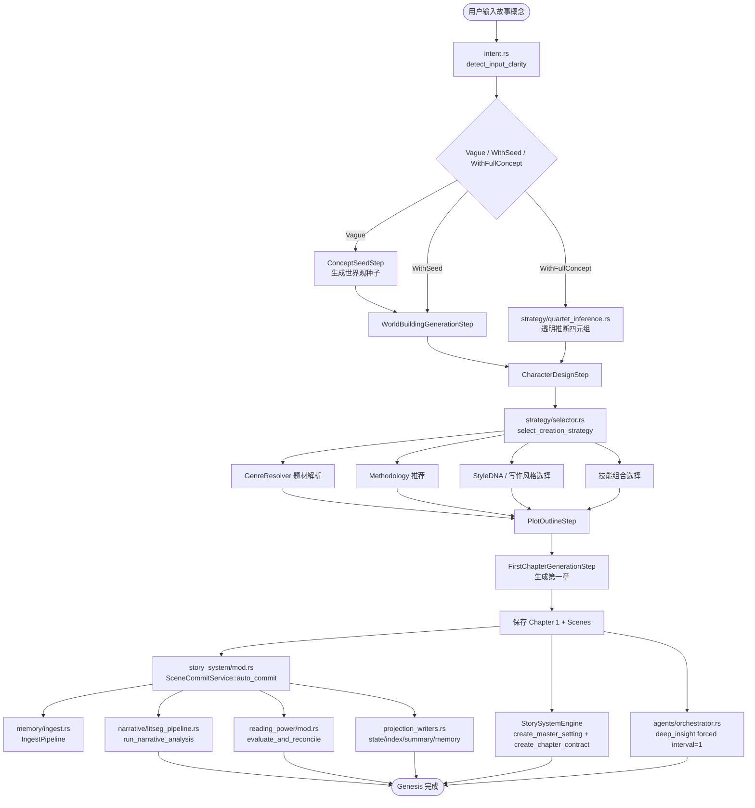
```mermaid
flowchart TB
    START([用户输入故事概念]) --> DETECT[intent.rs<br/>detect_input_clarity]
    DETECT --> CLARITY{Vague / WithSeed / WithFullConcept}

    CLARITY -->|Vague| SEED[ConceptSeedStep<br/>生成世界观种子]
    CLARITY -->|WithSeed| WB[WorldBuildingGenerationStep]
    CLARITY -->|WithFullConcept| QUARTET[strategy/quartet_inference.rs<br/>透明推断四元组]

    SEED --> WB
    WB --> CHAR[CharacterDesignStep]
    QUARTET --> CHAR

    CHAR --> STRATEGY[strategy/selector.rs<br/>select_creation_strategy]
    STRATEGY --> GENRE[GenreResolver 题材解析]
    STRATEGY --> METH[Methodology 推荐]
    STRATEGY --> STYLE[StyleDNA / 写作风格选择]
    STRATEGY --> SKILLS[技能组合选择]

    GENRE --> PLOT[PlotOutlineStep]
    METH --> PLOT
    STYLE --> PLOT
    SKILLS --> PLOT

    PLOT --> FCH[FirstChapterGenerationStep<br/>生成第一章]
    FCH --> SAVE[保存 Chapter 1 + Scenes]

    SAVE --> AUTO_COMMIT[story_system/mod.rs<br/>SceneCommitService::auto_commit]
    AUTO_COMMIT --> INGEST[memory/ingest.rs<br/>IngestPipeline]
    AUTO_COMMIT --> NAR[narrative/litseg_pipeline.rs<br/>run_narrative_analysis]
    AUTO_COMMIT --> RP[reading_power/mod.rs<br/>evaluate_and_reconcile]
    AUTO_COMMIT --> PROJ[projection_writers.rs<br/>state/index/summary/memory]

    SAVE --> CONTRACT[StorySystemEngine<br/>create_master_setting + create_chapter_contract]
    SAVE --> INSIGHT[agents/orchestrator.rs<br/>deep_insight forced interval=1]

    CONTRACT --> END([Genesis 完成])
    INSIGHT --> END
    NAR --> END
    RP --> END
    PROJ --> END
```

### 2.2 Genesis 步骤清单

| 步骤 | 文件/函数 | 产出 | 持久化 |
|------|----------|------|--------|
| 输入清晰度检测 | `intent.rs::detect_input_clarity` | `InputClarity` 枚举 | 运行时 |
| 概念种子 | `GenesisPipeline::ConceptSeedStep` | 故事核心概念 | `stories.concept` |
| 世界观生成 | `WorldBuildingGenerationStep` | 世界观条目 | `world_building` 表 |
| 人物设计 | `CharacterDesignStep` | 角色卡 | `characters` 表 |
| 四元组推断 | `strategy/quartet_inference.rs` | 情感回报/高压关系/冲突场/故事引擎/桥段卡 | `selected_strategies` |
| 策略选择 | `strategy/selector.rs::select_creation_strategy` | `SelectedStrategy` | `selected_strategies` |
| 情节大纲 | `PlotOutlineStep` | 幕级大纲 | `story_outlines` |
| 第一章生成 | `FirstChapterGenerationStep` | Chapter 1 + Scene | `chapters`、`scenes` |
| 合同播种 | `narrative/genesis.rs::ContractSeedingStep` | MASTER_SETTING + CHAPTER_1 合同 | `story_contracts` |
| 自动提交 | `SceneCommitService::auto_commit` | SceneCommit 记录 | `scene_commits` |
| 知识 ingest | `memory/ingest.rs` | 实体/关系/伏笔/角色状态 | `kg_entities`、`kg_relations`、`foreshadowing_tracker`、`character_states` |
| 叙事分析 | `narrative/litseg_pipeline.rs` | 幕级结构、事件强度、活跃线索 | `story_outlines.analyzed_structure_json` |
| 追读力评估 | `reading_power/mod.rs` | 钩子强度、债务 | `chapter_reading_power`、`chase_debt` |
| 深度洞察 | `agents/orchestrator.rs` | insight 摘要 | `story_summaries` 或运行时内存 |

### 2.3 Genesis 后的首次数据闭环

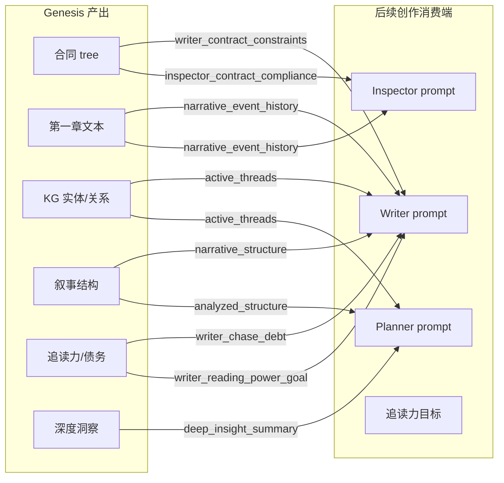
```mermaid
flowchart LR
    subgraph GenesisOutput["Genesis 产出"]
        A[合同 tree]
        B[第一章文本]
        C[KG 实体/关系]
        D[叙事结构]
        E[追读力/债务]
        F[深度洞察]
    end

    subgraph Consumers["后续创作消费端"]
        W[Writer prompt]
        I[Inspector prompt]
        P[Planner prompt]
        RP[追读力目标]
    end

    A -->|writer_contract_constraints| W
    A -->|inspector_contract_compliance| I
    B -->|narrative_event_history| W
    B -->|narrative_event_history| I
    C -->|active_threads| W
    C -->|active_threads| P
    D -->|narrative_structure| W
    D -->|analyzed_structure| P
    E -->|writer_chase_debt| W
    E -->|writer_reading_power_goal| W
    F -->|deep_insight_summary| P
```

**关键说明**

- `ContractSeedingStep` 在 Genesis 完成后立即写入 `MASTER_SETTING`（整本合同）和 `CHAPTER_1`（第一章合同），作为后续 Writer/Inspector/Pipeline 的真源。
- 第一章保存后，后台 spawn `SceneCommitService::auto_commit`，触发首次知识 ingest、叙事分析、追读力评估、投影写入。
- `deep_insight` 在 Genesis 后强制 interval=1 立即生成，供后续 Planner 使用。
- 所有新增提示词均通过 `PromptRegistry` 读取（`narrative_*_generate`、`writer_contract_constraints` 等），支持前端覆盖。

---

## 3. 拆书 Book Deconstruction 流程

### 3.1 拆书主流程

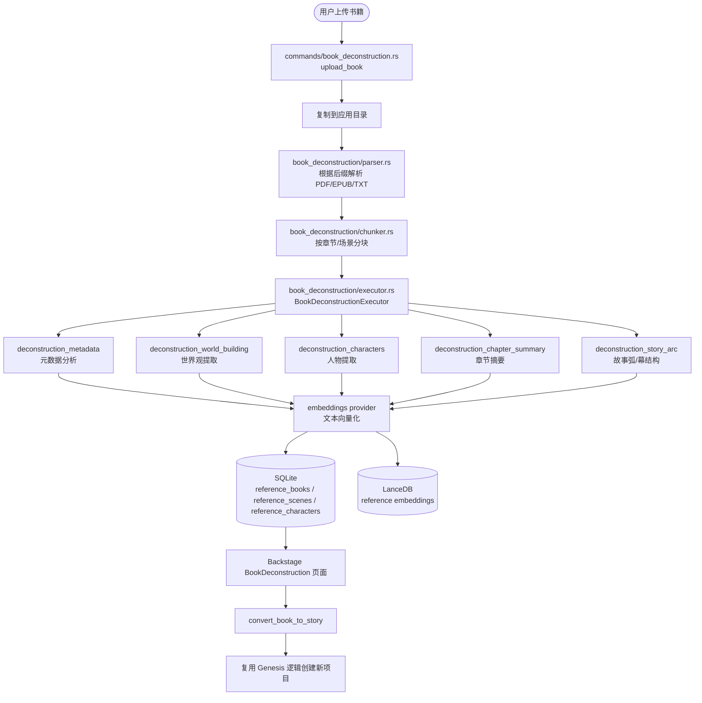
```mermaid
flowchart TB
    START([用户上传书籍]) --> UPLOAD[commands/book_deconstruction.rs<br/>upload_book]
    UPLOAD --> COPY[复制到应用目录]
    COPY --> PARSE[book_deconstruction/parser.rs<br/>根据后缀解析 PDF/EPUB/TXT]
    PARSE --> CHUNK[book_deconstruction/chunker.rs<br/>按章节/场景分块]
    CHUNK --> EXEC[book_deconstruction/executor.rs<br/>BookDeconstructionExecutor]

    EXEC --> META[deconstruction_metadata<br/>元数据分析]
    EXEC --> WORLD[deconstruction_world_building<br/>世界观提取]
    EXEC --> CHAR[deconstruction_characters<br/>人物提取]
    EXEC --> CHAP[deconstruction_chapter_summary<br/>章节摘要]
    EXEC --> ARC[deconstruction_story_arc<br/>故事弧/幕结构]

    META --> EMB[embeddings provider<br/>文本向量化]
    WORLD --> EMB
    CHAR --> EMB
    CHAP --> EMB
    ARC --> EMB

    EMB --> STORE[(SQLite<br/>reference_books / reference_scenes / reference_characters)]
    EMB --> VEC[(LanceDB<br/>reference embeddings)]

    STORE --> UI[Backstage BookDeconstruction 页面]
    UI --> CONVERT[convert_book_to_story]
    CONVERT --> GENESIS[复用 Genesis 逻辑创建新项目]
```

### 3.2 拆书资产与创作主路径的关联现状

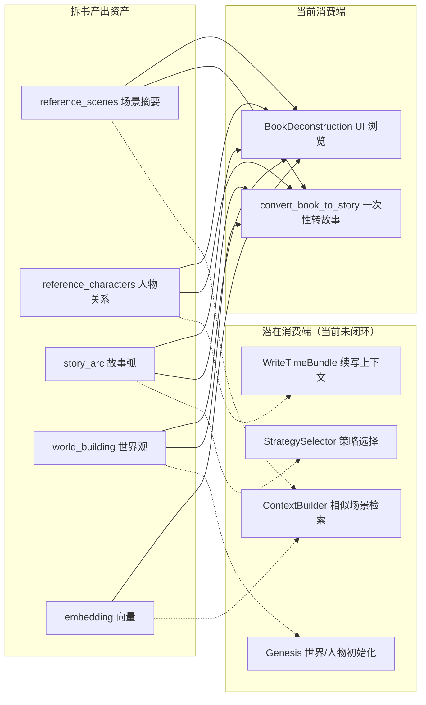
```mermaid
flowchart LR
    subgraph BookAssets["拆书产出资产"]
        A[reference_scenes 场景摘要]
        B[reference_characters 人物关系]
        C[story_arc 故事弧]
        D[world_building 世界观]
        E[embedding 向量]
    end

    subgraph CurrentConsumers["当前消费端"]
        V1[BookDeconstruction UI 浏览]
        V2[convert_book_to_story 一次性转故事]
    end

    subgraph PotentialConsumers["潜在消费端（当前未闭环）"]
        P1[StrategySelector 策略选择]
        P2[WriteTimeBundle 续写上下文]
        P3[ContextBuilder 相似场景检索]
        P4[Genesis 世界/人物初始化]
    end

    A --> V1
    A --> V2
    B --> V1
    B --> V2
    C --> V1
    C --> V2
    D --> V1
    D --> V2
    E --> V1

    A -.-> P3
    B -.-> P2
    C -.-> P1
    D -.-> P4
    E -.-> P3
```

**关键说明**

- 拆书系统本身功能完整：支持 PDF/EPUB/TXT 解析、分块、LLM 分析、向量化、双表存储、前端展示和一键转故事。
- **当前最大缺口**：拆书资产在一次性转故事后未持续回流到创作主路径。`reference_scenes` 的向量没有被 `ContextBuilder` 在续写时检索；`story_arc` 和 `world_building` 未参与 `StrategySelector` 的策略选择。
- 建议的闭环方向：
  1. `convert_book_to_story` 时根据拆书 genre 自动推荐/创建 `GenreProfile` 或 `StyleDNA`；
  2. `context_builder` / `write_time_bundle` 按当前章节检索参考书籍相似场景作为 few-shot；
  3. `select_strategy` 在 story 关联 reference_book 时，用拆书的 genre + world + arc 辅助策略选择。

---

## 4. 智能创作主路径

### 4.1 创作模式总览

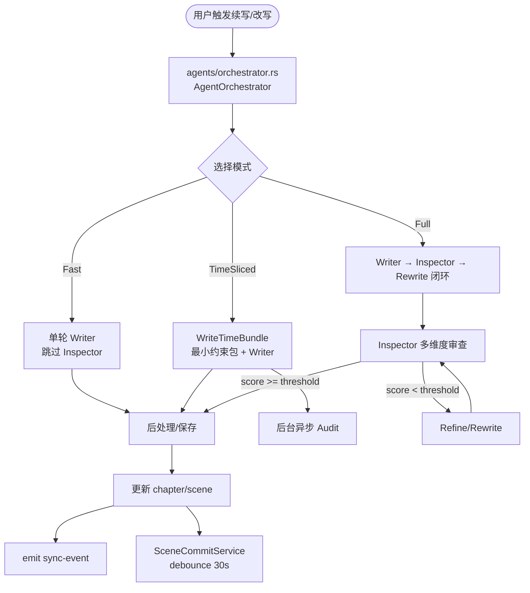
```mermaid
flowchart TB
    START([用户触发续写/改写]) --> ORCH[agents/orchestrator.rs<br/>AgentOrchestrator]
    ORCH --> MODE{选择模式}

    MODE -->|Fast| FAST[单轮 Writer<br/>跳过 Inspector]
    MODE -->|TimeSliced| TS[WriteTimeBundle<br/>最小约束包 + Writer]
    MODE -->|Full| FULL[Writer → Inspector → Rewrite 闭环]

    FAST --> POST[后处理/保存]
    TS --> ASYNC_AUDIT[后台异步 Audit]
    TS --> POST
    FULL --> INSP[Inspector 多维度审查]
    INSP -->|score >= threshold| POST
    INSP -->|score < threshold| REWRITE[Refine/Rewrite]
    REWRITE --> INSP

    POST --> SAVE[更新 chapter/scene]
    SAVE --> SYNC[emit sync-event]
    SAVE --> COMMIT[SceneCommitService<br/>debounce 30s]
```

### 4.2 Full 模式详细流程

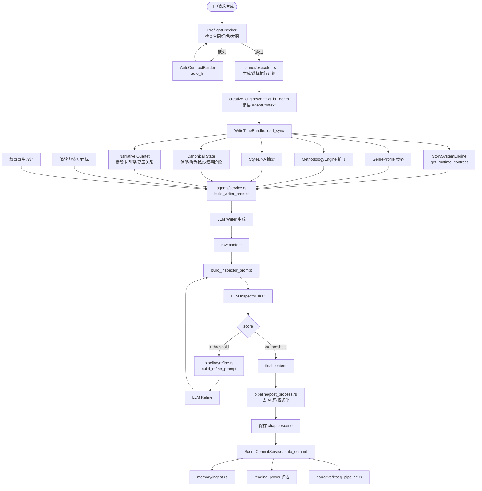
```mermaid
flowchart TB
    START([用户请求生成]) --> PREFLIGHT[PreflightChecker<br/>检查合同/角色/大纲]
    PREFLIGHT -->|缺失| AUTOFILL[AutoContractBuilder<br/>auto_fill]
    AUTOFILL --> PREFLIGHT
    PREFLIGHT -->|通过| PLAN[planner/executor.rs<br/>生成/选择执行计划]

    PLAN --> CTX[creative_engine/context_builder.rs<br/>组装 AgentContext]
    CTX --> WB[WriteTimeBundle::load_sync]

    WB --> CONTRACT[StorySystemEngine<br/>get_runtime_contract]
    WB --> GENRE[GenreProfile 策略]
    WB --> METHOD[MethodologyEngine 扩展]
    WB --> STYLE[StyleDNA 摘要]
    WB --> CANON[Canonical State<br/>伏笔/角色状态/叙事阶段]
    WB --> QUARTET[Narrative Quartet<br/>桥段卡/引擎/高压关系]

    CONTRACT --> W_PROMPT[agents/service.rs<br/>build_writer_prompt]
    GENRE --> W_PROMPT
    METHOD --> W_PROMPT
    STYLE --> W_PROMPT
    CANON --> W_PROMPT
    QUARTET --> W_PROMPT
    RP[追读力债务/目标] --> W_PROMPT
    NEH[叙事事件历史] --> W_PROMPT

    W_PROMPT --> LLM_W[LLM Writer 生成]
    LLM_W --> RESULT[raw content]

    RESULT --> I_PROMPT[build_inspector_prompt]
    I_PROMPT --> LLM_I[LLM Inspector 审查]
    LLM_I --> SCORE{score}

    SCORE -->|>= threshold| FINAL[final content]
    SCORE -->|< threshold| REFINE[pipeline/refine.rs<br/>build_refine_prompt]
    REFINE --> LLM_R[LLM Refine]
    LLM_R --> I_PROMPT

    FINAL --> POST[pipeline/post_process.rs<br/>去 AI 腔/格式化]
    POST --> SAVE[保存 chapter/scene]
    SAVE --> COMMIT[SceneCommitService::auto_commit]
    COMMIT --> INGEST[memory/ingest.rs]
    COMMIT --> RP_EVAL[reading_power 评估]
    COMMIT --> NAR[narrative/litseg_pipeline.rs]
```

### 4.3 Writer Prompt 组装顺序

```mermaid
flowchart LR
    SYS[writer_system] --> STORY[story variables]
    STORY --> NEH2[writer_narrative_event_history]
    NEH2 --> WS[writing_strategy]
    WS --> GENRE2[genre_profile 策略]
    GENRE2 --> METH2[methodology 扩展]
    METH2 --> CONTRACT2[writer_contract_constraints]
    CONTRACT2 --> CHASE[writer_chase_debt]
    CHASE --> RPG[writer_reading_power_goal]
    RPG --> STYLE2[StyleDNA / style_dna_summary]
    STYLE2 --> CANON2[Canonical State]
    CANON2 --> QUARTET2[Narrative Quartet]
    QUARTET2 --> LAG[Living Author Guard]
    LAG --> USER[writer_continue / writer_rewrite]
```

### 4.4 Inspector Prompt 组装顺序

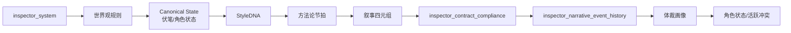
```mermaid
flowchart LR
    SYS[inspector_system] --> WB2[世界观规则]
    WB2 --> CANON3[Canonical State<br/>伏笔/角色状态]
    CANON3 --> STYLE3[StyleDNA]
    STYLE3 --> METH3[方法论节拍]
    METH3 --> QUARTET3[叙事四元组]
    QUARTET3 --> CONTRACT3[inspector_contract_compliance]
    CONTRACT3 --> NEH3[inspector_narrative_event_history]
    NEH3 --> GENRE3[体裁画像]
    GENRE3 --> CHAR[角色状态/活跃冲突]
```

**关键说明**

- `AgentOrchestrator` 提供 Fast/TimeSliced/Full 三种模式。Fast 追求低延迟；TimeSliced 用最小约束包平衡速度和质量；Full 模式做完整闭环审计/改写。
- `PreflightChecker` 在写前检查合同、角色、大纲是否完整；缺失时 `AutoContractBuilder` 用 LLM 自动补齐。
- `WriteTimeBundle` 是 TimeSliced 路径的最小约束包，从 DB 加载合同红线、角色状态、场景大纲、题材反模式、风格切片、方法论扩展、叙事阶段指导、待回收伏笔等。
- Writer/Inspector/Pipeline 的所有提示词段均通过 `PromptRegistry` 读取，支持前端实时覆盖。

---

## 5. Story System 合同/提交链/追读力闭环

### 5.1 Story System 子系统关系

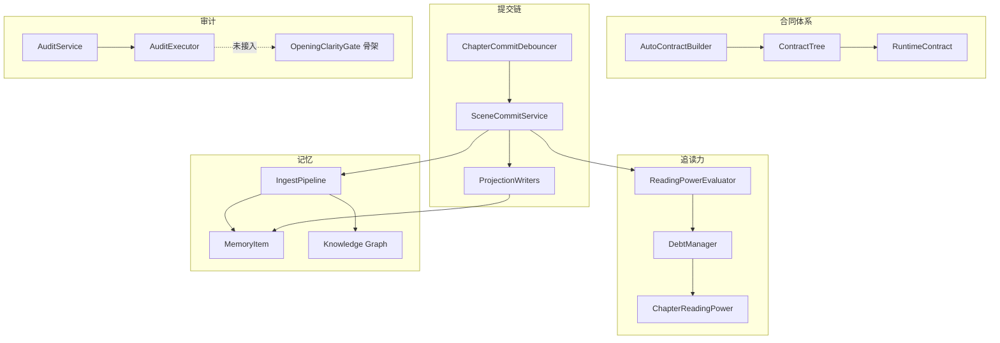
```mermaid
flowchart TB
    subgraph Contract["合同体系"]
        CT[ContractTree]
        RC[RuntimeContract]
        ACB[AutoContractBuilder]
    end

    subgraph Submission["提交链"]
        SCS[SceneCommitService]
        CD[ChapterCommitDebouncer]
        PW[ProjectionWriters]
    end

    subgraph ReadingPower["追读力"]
        RPE[ReadingPowerEvaluator]
        DM[DebtManager]
        CR[ChapterReadingPower]
    end

    subgraph Audit["审计"]
        AS[AuditService]
        AE[AuditExecutor]
        OCG[OpeningClarityGate 骨架]
    end

    subgraph Memory["记忆"]
        MI[MemoryItem]
        IP[IngestPipeline]
        KG[Knowledge Graph]
    end

    CT --> RC
    ACB --> CT

    SCS --> PW
    SCS --> IP
    SCS --> RPE
    CD --> SCS

    RPE --> DM
    DM --> CR

    AS --> AE
    AE -.->|未接入| OCG

    IP --> KG
    IP --> MI
    PW --> MI
```

### 5.2 合同约束回流创作流程

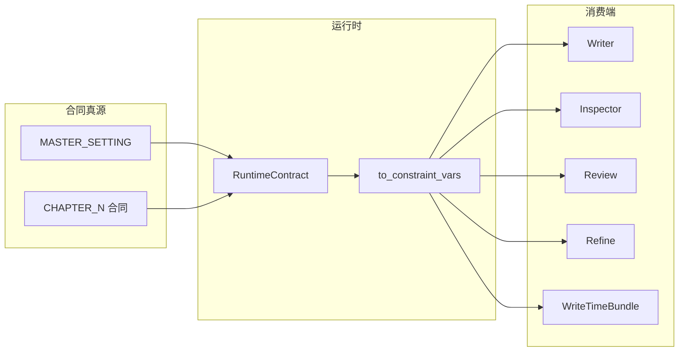
```mermaid
flowchart LR
    subgraph Source["合同真源"]
        MS[MASTER_SETTING]
        CC[CHAPTER_N 合同]
    end

    subgraph Runtime["运行时"]
        RT[RuntimeContract]
        VARS[to_constraint_vars]
    end

    subgraph Consumers["消费端"]
        W[Writer]
        I[Inspector]
        R[Review]
        F[Refine]
        WTB[WriteTimeBundle]
    end

    MS --> RT
    CC --> RT
    RT --> VARS
    VARS --> WTB
    VARS --> W
    VARS --> I
    VARS --> R
    VARS --> F
```

### 5.3 场景提交链流程

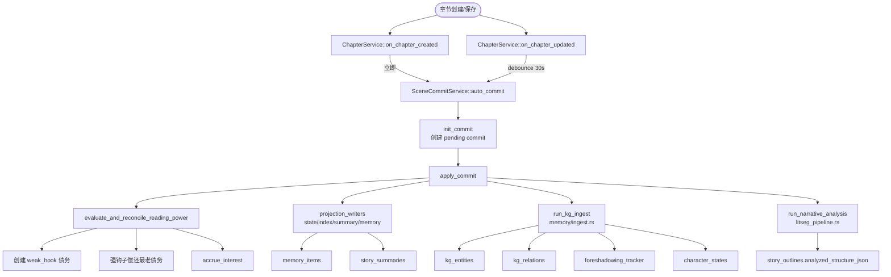
```mermaid
flowchart TB
    START([章节创建/保存]) --> ON_CREATE[ChapterService::on_chapter_created]
    START --> ON_UPDATE[ChapterService::on_chapter_updated]

    ON_CREATE -->|立即| AUTO_COMMIT[SceneCommitService::auto_commit]
    ON_UPDATE -->|debounce 30s| AUTO_COMMIT

    AUTO_COMMIT --> INIT[init_commit<br/>创建 pending commit]
    INIT --> APPLY[apply_commit]

    APPLY --> RP[evaluate_and_reconcile_reading_power]
    APPLY --> PW[projection_writers<br/>state/index/summary/memory]
    APPLY --> KG[run_kg_ingest<br/>memory/ingest.rs]
    APPLY --> NAR[run_narrative_analysis<br/>litseg_pipeline.rs]

    RP --> CREATE_DEBT[创建 weak_hook 债务]
    RP --> PAY_DEBT[强钩子偿还最老债务]
    RP --> INTEREST[accrue_interest]

    PW --> MI[memory_items]
    PW --> SUM[story_summaries]
    KG --> ENT[kg_entities]
    KG --> REL[kg_relations]
    KG --> FORE[foreshadowing_tracker]
    KG --> CHST[character_states]
    NAR --> SO[story_outlines.analyzed_structure_json]
```

### 5.4 追读力闭环

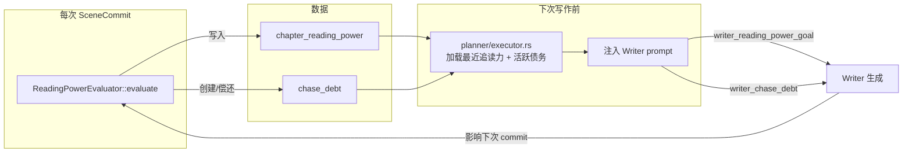
```mermaid
flowchart LR
    subgraph Commit["每次 SceneCommit"]
        EVAL[ReadingPowerEvaluator::evaluate]
    end

    subgraph Data["数据"]
        CRP[chapter_reading_power]
        DEBT[chase_debt]
    end

    subgraph WriteTime["下次写作前"]
        LOAD[planner/executor.rs<br/>加载最近追读力 + 活跃债务]
        INJECT[注入 Writer prompt]
    end

    EVAL -->|写入| CRP
    EVAL -->|创建/偿还| DEBT
    CRP --> LOAD
    DEBT --> LOAD
    LOAD --> INJECT
    INJECT -->|writer_reading_power_goal| W
    INJECT -->|writer_chase_debt| W
    W[Writer 生成] -->|影响下次 commit| EVAL
```

**关键说明**

- **合同体系**：`story_contracts` 表存储 `MASTER_SETTING`（整本合同）、`VOLUME`、`CHAPTER`、`REVIEW` 类型合同。`RuntimeContract` 是写时真源，通过 `to_constraint_vars()` 转成 prompt 变量注入 Writer/Inspector/Pipeline。
- **提交链**：`SceneCommitService` 在章节创建时立即 commit，在章节保存时 30s debounce 后 commit。`apply_commit` 触发追读力评估、投影写入、KG ingest、叙事分析。
- **追读力**：每次 commit 评估 hook_score、coolpoint_score、debt_penalty；弱钩子创建 `weak_hook` 债务（due_chapter = current + 3），强钩子偿还最老活跃债务。Writer 写前加载最近追读力目标和活跃债务。
- **当前缺口**：
  - `SceneCommitService::auto_commit` 仍用 `"{}"` 占位 review/fulfillment/accepted_events/state_deltas/entity_deltas；
  - `reading_power/evaluator.rs` 为空，hook/coolpoint/micropayoff 提取尚未实现；
  - `OpeningClarityGate` 骨架未接入生产；
  - `Volume`/`Review` 合同类型未使用。

---

## 6. 叙事分析/活跃线索/深度洞察生成与消费

### 6.1 生成侧

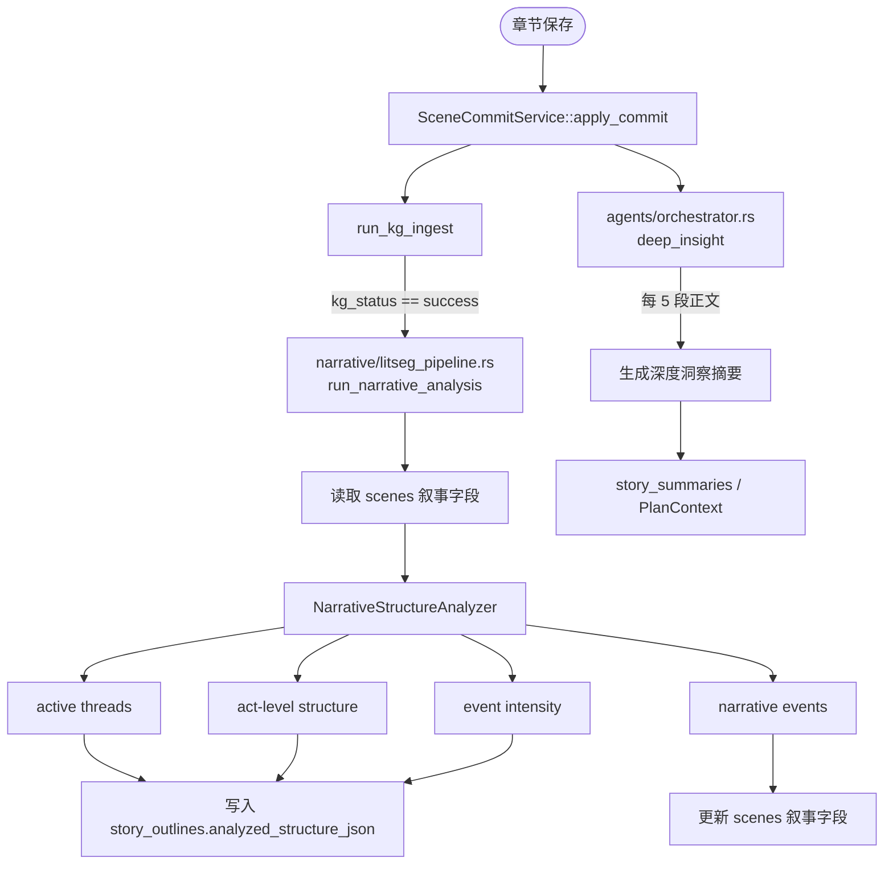
```mermaid
flowchart TB
    START([章节保存]) --> COMMIT[SceneCommitService::apply_commit]
    COMMIT --> KG[run_kg_ingest]
    KG -->|kg_status == success| NAR[narrative/litseg_pipeline.rs<br/>run_narrative_analysis]

    NAR --> READ[读取 scenes 叙事字段]
    READ --> ANALYZE[NarrativeStructureAnalyzer]
    ANALYZE --> ACT[active threads]
    ANALYZE --> EVENT[narrative events]
    ANALYZE --> STRUCT[act-level structure]
    ANALYZE --> INTENSITY[event intensity]

    ACT --> SO[写入 story_outlines.analyzed_structure_json]
    EVENT --> SCENES[更新 scenes 叙事字段]
    STRUCT --> SO
    INTENSITY --> SO

    COMMIT --> INSIGHT[agents/orchestrator.rs<br/>deep_insight]
    INSIGHT -->|每 5 段正文| DI[生成深度洞察摘要]
    DI --> SUM[story_summaries / PlanContext]
```

### 6.2 消费侧

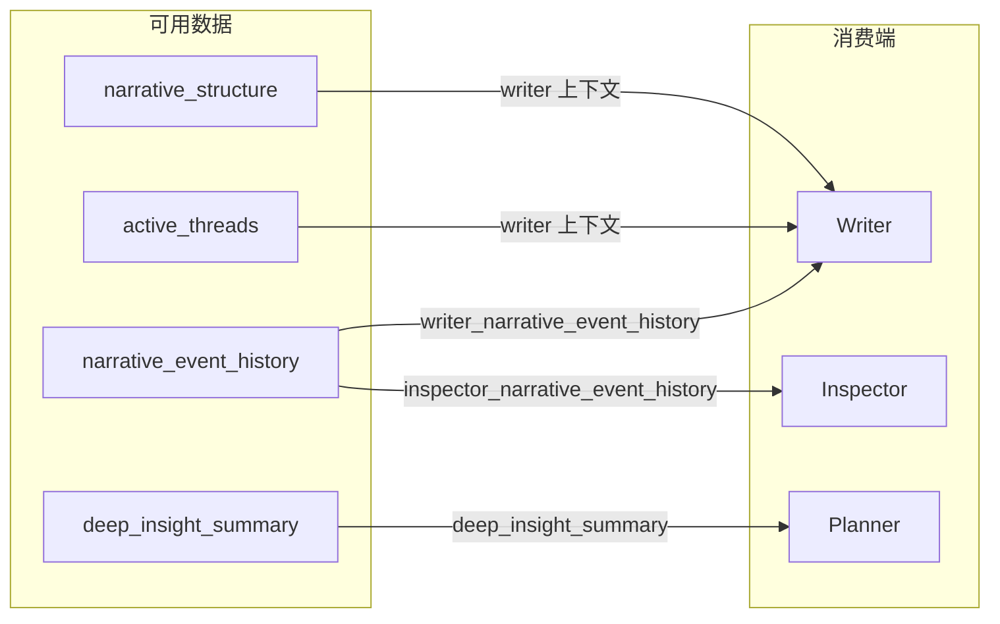
```mermaid
flowchart LR
    subgraph DataSources["可用数据"]
        NS[narrative_structure]
        AT[active_threads]
        NEH[narrative_event_history]
        DI2[deep_insight_summary]
    end

    subgraph Consumers2["消费端"]
        W3[Writer]
        I3[Inspector]
        P3[Planner]
    end

    NS -->|writer 上下文| W3
    AT -->|writer 上下文| W3
    NEH -->|writer_narrative_event_history| W3
    NEH -->|inspector_narrative_event_history| I3
    DI2 -->|deep_insight_summary| P3
```

**关键说明**

- **生成侧**：`run_narrative_analysis` 只有在 KG ingest 成功后才执行；分析结果写入 `story_outlines.analyzed_structure_json`，并更新 `scenes` 表的叙事字段。
- **深度洞察**：`deep_insight` 默认每 5 段正文生成一次（Genesis 后强制 interval=1），结果供 Planner 使用。
- **消费侧**：`ContextOptimizer` 在 `build_full_context` 中并行加载 `narrative_structure`、`active_threads`、`narrative_event_history`；`PlanContext` 新增 `deep_insight_summary` 字段，Planner prompt 消费该数据。
- 新增 PromptRegistry key：`writer_narrative_event_history`、`inspector_narrative_event_history`。

---

## 7. PromptRegistry + 网文模板 + 方法论注入流程

### 7.1 PromptRegistry 架构

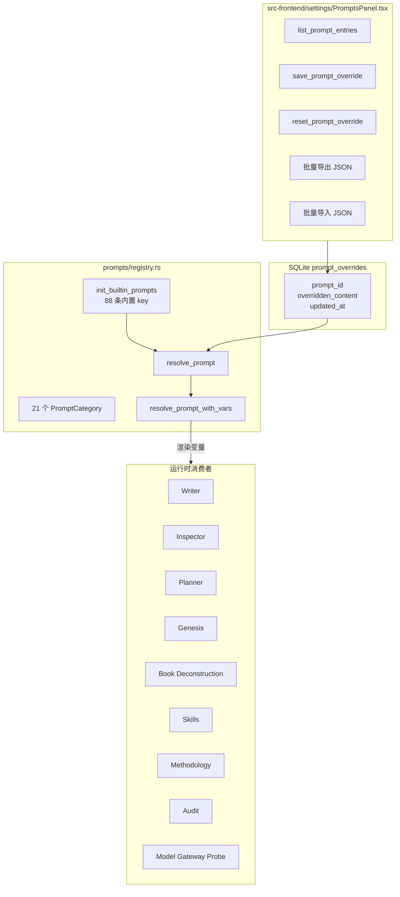
```mermaid
flowchart TB
    subgraph Registry["prompts/registry.rs"]
        INIT[init_builtin_prompts<br/>88 条内置 key]
        CAT[21 个 PromptCategory]
        RES[resolve_prompt]
        RESV[resolve_prompt_with_vars]
    end

    subgraph DB2["SQLite prompt_overrides"]
        PO[prompt_id<br/>overridden_content<br/>updated_at]
    end

    subgraph Frontend2["src-frontend/settings/PromptsPanel.tsx"]
        LIST[list_prompt_entries]
        SAVE[save_prompt_override]
        RESET[reset_prompt_override]
        EXPORT[批量导出 JSON]
        IMPORT[批量导入 JSON]
    end

    subgraph Consumers3["运行时消费者"]
        W4[Writer]
        I4[Inspector]
        P4[Planner]
        G4[Genesis]
        BD4[Book Deconstruction]
        SKL4[Skills]
        METH4[Methodology]
        AUD4[Audit]
        MG4[Model Gateway Probe]
    end

    INIT --> RES
    PO --> RES
    RES --> RESV
    RESV -->|渲染变量| Consumers3
    Frontend2 --> PO
```

### 7.2 网文模板与题材画像

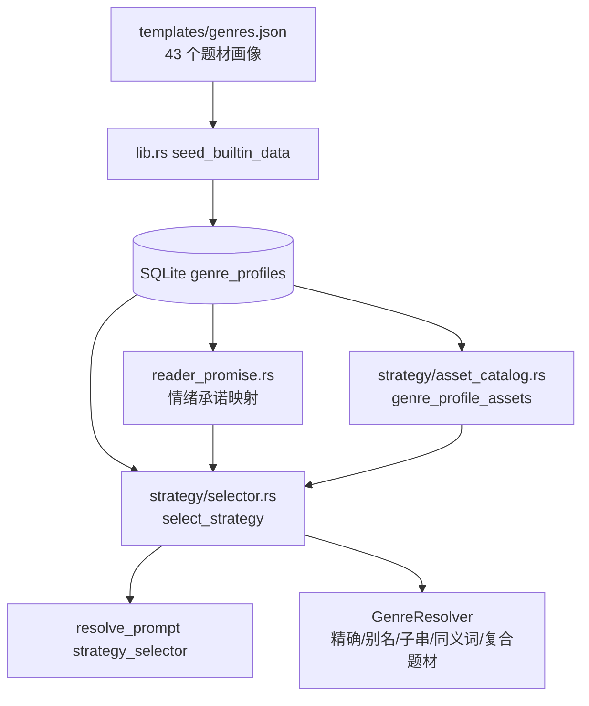
```mermaid
flowchart TB
    FILE2[templates/genres.json<br/>43 个题材画像] --> SEED[lib.rs seed_builtin_data]
    SEED --> GP[(SQLite genre_profiles)]
    GP --> READER[reader_promise.rs<br/>情绪承诺映射]
    GP --> ASSET2[strategy/asset_catalog.rs<br/>genre_profile_assets]
    GP --> SELECT[strategy/selector.rs<br/>select_strategy]

    SELECT --> RESOLVE[resolve_prompt strategy_selector]
    SELECT --> GENRE_RES[GenreResolver<br/>精确/别名/子串/同义词/复合题材]

    READER --> SELECT
    ASSET2 --> SELECT
```

### 7.3 方法论与创意资产注入

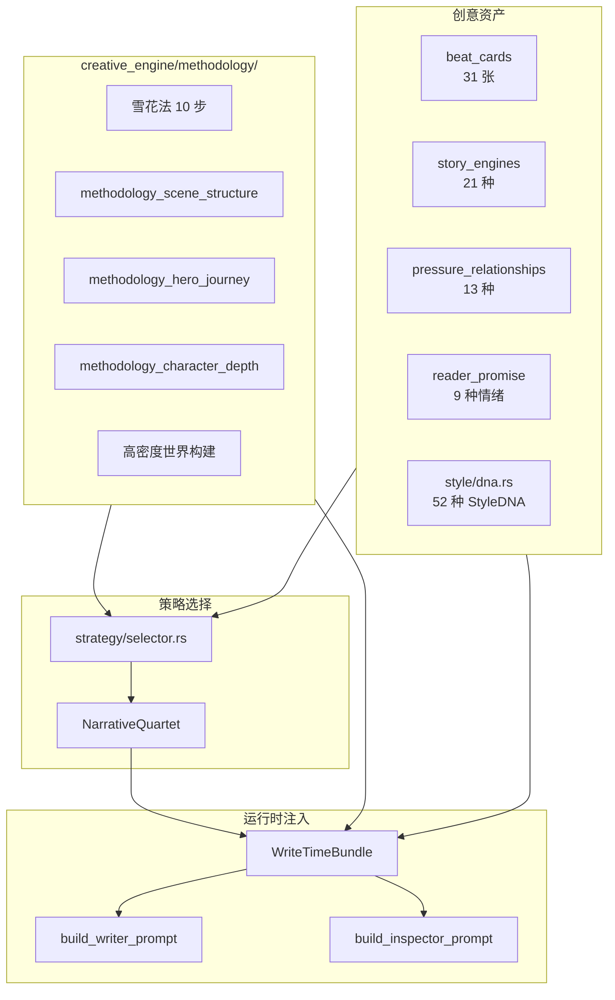
```mermaid
flowchart TB
    subgraph Methodology["creative_engine/methodology/"]
        SNOW[雪花法 10 步]
        SCENE[methodology_scene_structure]
        HERO[methodology_hero_journey]
        CHAR2[methodology_character_depth]
        HDWB[高密度世界构建]
    end

    subgraph Assets["创意资产"]
        BC[beat_cards<br/>31 张]
        SE2[story_engines<br/>21 种]
        PR[pressure_relationships<br/>13 种]
        RP2[reader_promise<br/>9 种情绪]
        SDNA[style/dna.rs<br/>52 种 StyleDNA]
    end

    subgraph Selection["策略选择"]
        SEL[strategy/selector.rs]
        QUARTET2[NarrativeQuartet]
    end

    subgraph Runtime2["运行时注入"]
        WTB2[WriteTimeBundle]
        W_PROMPT2[build_writer_prompt]
        I_PROMPT2[build_inspector_prompt]
    end

    Methodology --> SEL
    Assets --> SEL
    SEL --> QUARTET2
    QUARTET2 --> WTB2
    Methodology --> WTB2
    Assets --> WTB2
    WTB2 --> W_PROMPT2
    WTB2 --> I_PROMPT2
```

**关键说明**

- **PromptRegistry**：88 条内置 key，21 个分类，所有 LLM 提示词优先从 DB `prompt_overrides` 读取，否则回退内置默认。前端 `PromptsPanel` 支持 Monaco 编辑、搜索、批量导入导出。
- **网文模板**：`templates/genres.json` 包含 43 个网文题材画像，启动时导入 `genre_profiles` 表；`reader_promise.rs` 为每个题材映射 1~3 种主情绪承诺。
- **方法论**：5 种类型共 19 条提示词（雪花法 10 步 + 场景结构 + 英雄之旅 + 人物深度 + 高密度世界构建）。`MethodologyEngine::build_prompt_extension()` 根据 `MethodologyConfig` 注入 Writer prompt。
- **创意资产**：31 张桥段卡、21 种叙事引擎、13 种高压关系、52 种 StyleDNA、5 个内置技能。这些资产通过 `StrategySelector` 组合成 `NarrativeQuartet`，再进入 `WriteTimeBundle` 和 Writer/Inspector prompt。

---

## 8. 数据持久化与同步总览

### 8.1 数据层架构

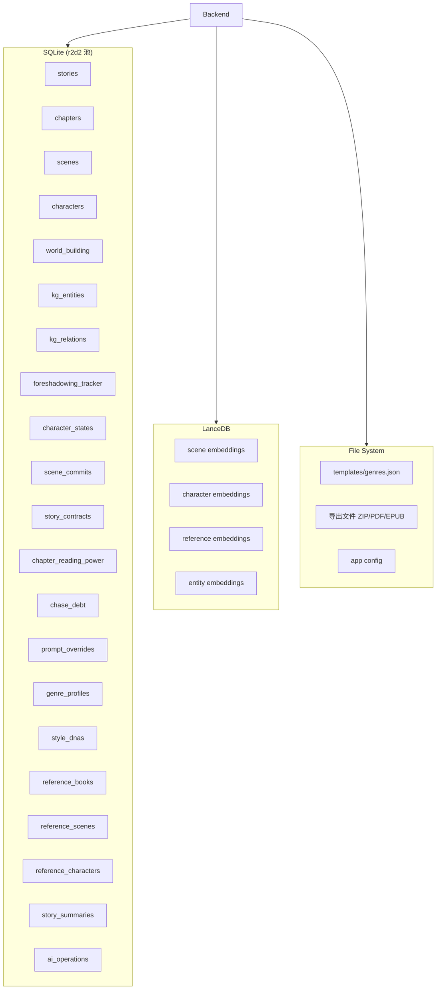
```mermaid
flowchart TB
    subgraph SQLite["SQLite (r2d2 池)"]
        STORIES[stories]
        CHAPTERS[chapters]
        SCENES[scenes]
        CHARS[characters]
        WB3[world_building]
        KG_E[kg_entities]
        KG_R[kg_relations]
        FT[foreshadowing_tracker]
        CST[character_states]
        SC[scene_commits]
        SCC[story_contracts]
        CRP2[chapter_reading_power]
        CD2[chase_debt]
        PO2[prompt_overrides]
        GP2[genre_profiles]
        SDNA2[style_dnas]
        RB[reference_books]
        RS[reference_scenes]
        RC2[reference_characters]
        SS2[story_summaries]
        AI_OP[ai_operations]
    end

    subgraph Vector["LanceDB"]
        V_SCENE[scene embeddings]
        V_CHAR[character embeddings]
        V_REF[reference embeddings]
        V_ENT[entity embeddings]
    end

    subgraph FS2["File System"]
        GENRES[templates/genres.json]
        EXPORT[导出文件 ZIP/PDF/EPUB]
        CONFIG[app config]
    end

    Backend --> SQLite
    Backend --> Vector
    Backend --> FS2
```

### 8.2 同步事件总线

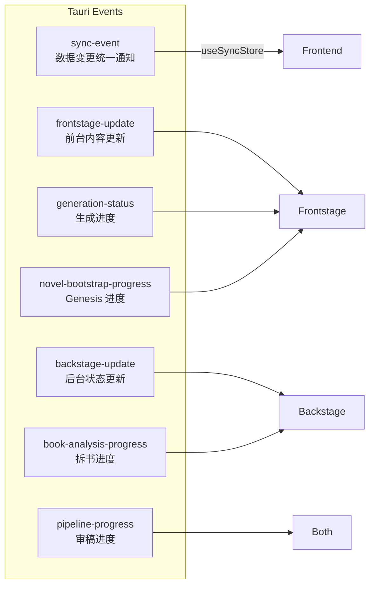
```mermaid
flowchart LR
    subgraph Events["Tauri Events"]
        SE[sync-event<br/>数据变更统一通知]
        FU[frontstage-update<br/>前台内容更新]
        BU[backstage-update<br/>后台状态更新]
        GS[generation-status<br/>生成进度]
        BS2[novel-bootstrap-progress<br/>Genesis 进度]
        BA[book-analysis-progress<br/>拆书进度]
        PP[pipeline-progress<br/>审稿进度]
    end

    SE -->|useSyncStore| Frontend
    FU --> Frontstage
    BU --> Backstage
    GS --> Frontstage
    BS2 --> Frontstage
    BA --> Backstage
    PP --> Both
```

**关键说明**

- **SQLite**：主存储，覆盖故事、章节、场景、角色、世界观、KG、合同、提交、追读力、提示词覆盖、拆书等。
- **LanceDB**：向量检索，存储场景、角色、参考书籍、实体的 embedding。
- **同步机制**：后端变更后发射 `sync-event`，前端 `useSyncStore` 监听并失效相关 TanStack Query 缓存；`frontstage-update`/`backstage-update` 负责跨窗口内容同步。

---

## 9. 前端双界面编排流程

### 9.1 前端架构

```mermaid
flowchart TB
    subgraph Backstage["Backstage 幕后"]
        APP[App.tsx]
        SIDEBAR[Sidebar]
        PAGES["pages/*.tsx"]
        SETTINGS["pages/settings/*.tsx"]
    end

    subgraph Frontstage["Frontstage 幕前"]
        FAPP[FrontstageApp.tsx]
        EDITOR[RichTextEditor]
        WEN[WenSiPanel 文思三态]
        HINT[SmartHintSystem]
    end

    subgraph State["状态管理"]
        ZUSTAND["Zustand stores"]
        TQUERY["TanStack Query"]
        SYNC["useSyncStore"]
    end

    APP --> PAGES
    APP --> SETTINGS
    PAGES --> TQUERY
    SETTINGS --> TQUERY
    TQUERY --> API["services/api/*.ts"]
    API -->|invoke| Backend

    FAPP --> EDITOR
    FAPP --> WEN
    FAPP --> HINT
    FAPP --> API

    Backend -->|events| SYNC
    SYNC --> TQUERY
```

### 9.2 用户创作闭环

```mermaid
flowchart LR
    A[Backstage Stories] -->|创建/Genesis| B[故事创建完成]
    B -->|FrontstageLauncher| C[打开 Frontstage]
    C --> D[用户编辑/触发 smart_execute]
    D -->|check_preflight| E{通过?}
    E -->|否| F[auto_create_missing_contracts]
    E -->|是| G[smart_execute]
    G --> H[生成内容追加到编辑器]
    H --> I[自动保存 update_chapter]
    I --> J[后端 emit sync-event]
    J --> K[前后台缓存失效]
    I --> L[SceneCommitService 30s debounce]
    L --> M[KG ingest / 追读力 / 叙事分析]
```

**关键说明**

- **Backstage**：使用 `App.tsx` 作为 shell，`currentView` 控制页面切换，非 React Router。
- **Frontstage**：独立的 `FrontstageApp.tsx`，专注沉浸式写作，包含 `RichTextEditor`、`WenSiPanel`（文思三态）、`SmartHintSystem`。
- **状态管理**：Zustand 管理 UI 状态，TanStack Query 管理服务端状态，`useSyncStore` 负责 `sync-event` 监听与缓存失效。
- **创作闭环**：用户在 Frontstage 触发 `smart_execute` → 后端执行创作流程 → 返回内容追加到编辑器 → 自动保存 → 后端 emit 事件 → 前后台同步 → 提交链触发后续分析。

---

## 10. 核心资产清单

### 10.1 PromptRegistry 提示词（88 条，21 分类）

| 分类 | 数量 | 代表性 key |
|------|------|-----------|
| Methodology | 19 | `methodology_snowflake_step1..10`、`methodology_scene_structure`、`methodology_hero_journey`、`methodology_character_depth`、`methodology_hdwb_*` |
| Creation | 18 | `narrative_*_generate/extract`、`novel_creation_*` |
| Writer | 9 | `writer_system`、`writer_continue`、`writer_rewrite`、`orchestrator_timesliced_writer`、`writer_contract_constraints`、`writer_chase_debt`、`writer_reading_power_goal`、`writer_narrative_event_history`、`write_time_bundle_contract` |
| Pipeline | 6 | `pipeline_review`、`pipeline_refine`、`pipeline_post_process_*`、`review_contract_criteria`、`refine_contract_criteria` |
| System | 6 | `agent_world_building/character/writing_style/scene/plot`、`style_mimic` |
| Skill | 5 | `skill_style_enhancer`、`skill_plot_twist`、`skill_text_formatter`、`skill_character_voice`、`skill_emotion_pacing` |
| Inspector | 3 | `inspector_system`、`inspector_contract_compliance`、`inspector_narrative_event_history` |
| Deconstruction | 5 | `deconstruction_metadata`、`deconstruction_world_building`、`deconstruction_characters`、`deconstruction_chapter_summary`、`deconstruction_story_arc` |
| Memory/Knowledge | 4 | `memory_compressor`、`memory_content_analysis`、`knowledge_distiller`、`memory_knowledge_generation` |
| Planner/World/Character/Commentator/Analyzer/Audit/Intent/Strategy/Narrative/Probe | 各 1~3 | `outline_planner`、`planner_generator`、`commentator_system`、`plot_analysis`、`audit_quality_inspector`、`intent_analyzer`、`strategy_selector`、`narrative_event_extraction`、`model_gateway_probe` |

### 10.2 网文题材模板

| 资产 | 路径 | 数量 |
|------|------|------|
| 题材画像 JSON | `templates/genres.json` | 43 |
| 题材画像 Markdown | `templates/genres/*.md` | 43 |
| 情绪承诺映射 | `src-tauri/src/creative_engine/reader_promise.rs` | 9 种主情绪 |

### 10.3 创意资产

| 资产 | 路径 | 数量 |
|------|------|------|
| 创作方法论 | `src-tauri/src/creative_engine/methodology/` | 5 种类型，19 条提示词 |
| 桥段卡 | `src-tauri/src/creative_engine/beat_cards/registry.rs` | 31 张 |
| 叙事引擎 | `src-tauri/src/creative_engine/story_engines/mod.rs` | 21 种 |
| 高压关系 | `src-tauri/src/creative_engine/pressure_relationships/mod.rs` | 13 种 |
| 风格 DNA | `src-tauri/src/creative_engine/style/dna.rs` + `classic_styles.rs` | 52 种 |
| 内置技能 | `src-tauri/src/skills/builtin.rs` | 5 个 |

### 10.4 Story System 子系统

| 子系统 | 关键文件 | 状态 |
|--------|----------|------|
| 合同树/运行时合同 | `story_system/mod.rs` | 活跃，已注入 Writer/Inspector/Pipeline |
| 场景提交链 | `story_system/mod.rs::SceneCommitService` | 活跃，debounce 30s |
| 追读力 | `reading_power/mod.rs` | 半活跃，评估+债务已闭环，但 evaluator.rs 为空 |
| 审计 | `audit/mod.rs`、`task_system/audit_executor.rs` | 活跃，OpeningClarityGate 未接入 |
| 记忆/KG | `memory/ingest.rs` | 活跃，场景更新/commit 均触发 |
| 体裁画像 | `strategy/selector.rs`、`creative_engine/reader_promise.rs` | 活跃 |
| 风格 DNA | `creative_engine/style/dna.rs` | 活跃但调用链较浅 |

---

## 附录：当前关键集成缺口与建议方向

| 缺口 | 影响 | 建议 |
|------|------|------|
| 拆书资产未持续回流创作主路径 | 参考书籍向量/故事弧/人物关系成为孤岛 | 在 `context_builder`/`write_time_bundle` 中检索参考书籍相似场景；在 `select_strategy` 中消费拆书 arc/world |
| `SceneCommitService::auto_commit` 占位字段 | state/index/memory projection writers 缺少真实输入 | 移除 `"{}"` 占位，接入真实 review/fulfillment/事件 deltas |
| `reading_power/evaluator.rs` 为空 | hook/coolpoint/micropayoff 无法从文本提取 | 实现基于规则+LLM 的轻量提取器 |
| `OpeningClarityGate` 未接入 | 开篇清晰度审计无法自动触发 | 接入 `AuditService` 或 `AuditExecutor` |
| `contract_builder.rs` 空壳 | 合同自动构建能力不完整 | 填充合同模板构建逻辑 |
| 20 模块 Mega-SCC | 架构变更传播半径过大 | 提取中性 domain/types 模块，切断循环依赖 |

---

> **文档维护**：本流程图应与代码同步更新。每次新增创作子系统、修改数据流或调整 PromptRegistry 分类时，应同步更新本节相关流程图与资产清单。
