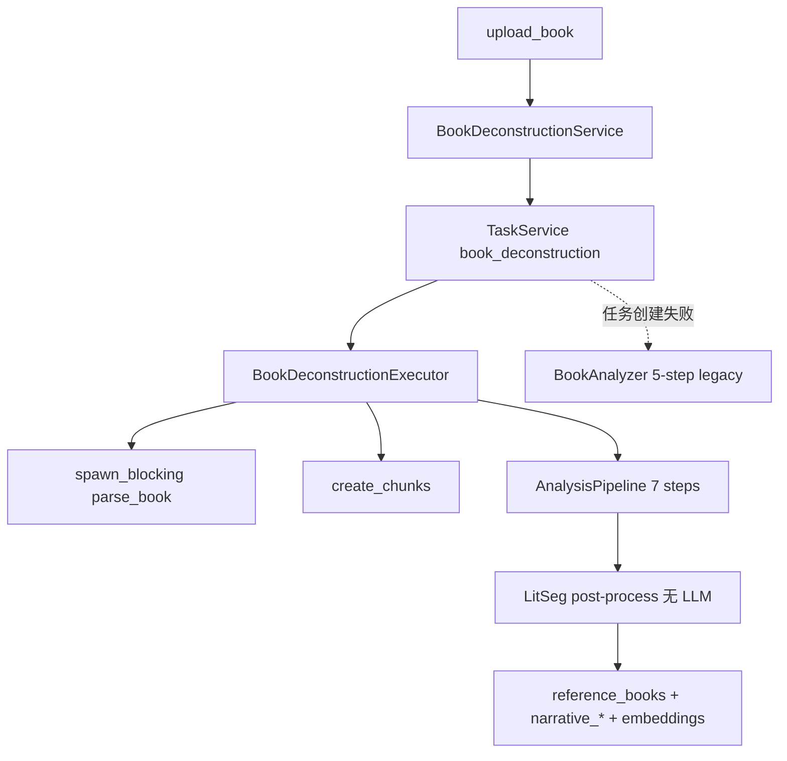

# StoryMoss「拆书」全过程审计报告

> **审计日期：** 2026-07-09  
> **代码基线：** v0.26.45（inspected）  
> **范围：** 产品入口 → 解析分块 → AnalysisPipeline → LitSeg → 落库 → 转故事 → 续写回流  
> **证据标签：** executed = 跑过命令/测试；inspected = 读代码/文档；assumed = 推断  

**一句话结论：** 拆书在架构上已完成「创世-拆书同构」与统一存储，但对**后续写作质量的实际增益**仍走窄路径（`reference_book_id` → 关键词 few-shots + 策略摘要）。最大结构性缺口是 **Pipeline 第 5–6 步产出未可靠落库**、**已建向量未用于检索**、以及 **双实现 / 测试 / 可观测性债务**。

---

## 0. 执行摘要

| 维度 | 评级 | 说明 |
|------|------|------|
| 产品可用性 | B | 上传→分析→详情→转故事闭环可用；文档承诺偏高 |
| 管线完整性 | C+ | 7 步 AnalysisPipeline 存在，但故事线/伏笔/作者落库断裂 |
| 资产利用率 | D+ | 拆书时几乎不消费 Genre/StyleDNA/Methodology；续写仅薄回流 |
| 与续写闭环 | C | few-shots 关键词 Jaccard，非向量；无合同/KG 继承 |
| 测试与可观测 | D | ~12 Rust 专测；0 vitest/e2e；无拆书 run 表 |
| 架构健康 | B | 分层基本合规；双 Pipeline 遗留是主债 |

**若目标是「拆书显著提升续写质量」：** 优先修持久化闭环 + WriteTimeBundle 向量检索，而非先做 UI 图表。

---

## 1. 产品表面

### 1.1 入口

| 入口 | 位置 | 备注 |
|------|------|------|
| 幕后侧栏「拆书」 | `src-frontend/src/components/Sidebar.tsx`（创作工具组，`impact: warm`） | 主入口 |
| 页面 | `src-frontend/src/pages/BookDeconstruction.tsx` | `appStore.currentView`，无独立 URL |
| 任务页筛选 | `src-frontend/src/pages/Tasks.tsx` | `book_deconstruction` |
| 拆书页内设置 | 底部折叠 → `GeneralSettings sections={['book']}` | 并发 `book_deconstruction_concurrency` |

**无：** 幕前入口、菜单栏命令、MCP 直接触发。

### 1.2 用户可见流程

```
上传 (txt/pdf/epub, ≤100MB)
  → 解析 + 分块
  → LLM 分析（主路径 7 步）+ LitSeg 后处理
  → 保存 DB + 向量
  → 详情四 Tab（概览 / 人物 / 章节 / 故事线）
  → 一键转故事
```

**IPC（7）：** `upload_book` / `get_analysis_status` / `get_book_analysis` / `list_reference_books` / `delete_reference_book` / `convert_book_to_story` / `cancel_book_analysis`  
（`src-tauri/src/book_deconstruction/commands.rs`；Pro 门控 `book_deconstruction`）

**进度 UI：** `AnalysisProgress.tsx` 展示 **8** 个大步骤；后端 AnalysisPipeline 为 **7** 步 + 保存/LitSeg——步数语义不完全对齐（inspected）。

### 1.3 文档 vs 现实

| 文档承诺 | 现实 |
|----------|------|
| USER_GUIDE §3.9：三幕式、高潮曲线、角色出场频率、图表报告 | 仅有部分 LitSeg 条形（`StoryArcView`）；无完整诊断页 |
| `docs/plans/2026-04-19-book-deconstruction-design.md` | 仍描述已删除的 `reference_characters/scenes/chunks` |
| `PROJECT_PROCESS_FLOWCHARTS_v0.22.4.md` §3 | 仍写 5 步 `deconstruction_*` 旧路径 |

---

## 2. 管线架构

### 2.1 主路径（现行）



| 组件 | 路径 | 同步性 |
|------|------|--------|
| Executor | `src-tauri/src/book_deconstruction/executor.rs` | 混合 |
| AnalysisPipeline | `src-tauri/src/narrative/analysis.rs` | 逐步 async；角色/场景 chunk 并发 semaphore=3 |
| LitSeg（拆书） | executor 内后处理 | 同步、无 LLM |
| LitSeg（写作 ingest） | `narrative/litseg_pipeline.rs` | **拆书不调用** |
| Legacy | `book_deconstruction/analyzer.rs`（~1032 行） | 仅 fallback |

### 2.2 AnalysisPipeline 七步

| # | Step | LLM? | 落库现状 |
|---|------|------|----------|
| 1 | MetadataExtraction | 是 | 部分：title/genre/description；**author 丢失** |
| 2 | WorldBuildingExtraction | 是 | `reference_books.world_setting`（JSON 字符串） |
| 3 | CharacterExtraction | 是（每 chunk） | `narrative_characters`（story_id=book_id） |
| 4 | SceneExtraction | 是（每 chunk） | `narrative_scenes` |
| 5 | StoryArcExtraction | 是 | **解析后 `_arc` 丢弃**（`analysis.rs` ~762） |
| 6 | ForeshadowingExtraction | 是 | 仅内存 bundle；KG 步可启发式用；**无独立 foreshadowing 表写入** |
| 7 | KnowledgeGraphExtraction | **否** | `kg_*`，story_id=book_id |

**LLM 量：** ≈ `5 + 2N`（N = chunk 数）。长篇成本与超时风险高。

### 2.3 分块策略（`chunker.rs`）

- ≤10 万字：1 chunk  
- 10–50 万：按章（>200 章转 narrative-aware）  
- >50 万：narrative-aware（章边界 + 场景切分）

### 2.4 与创世 / 续写的关系

| 关联 | 现状 |
|------|------|
| Genesis | 共用 `NarrativeBundle` 抽象；**不**共用 AnalysisPipeline |
| `stories.reference_book_id` | 转故事时设置 |
| WriteTimeBundle | `load_reference_scene_fewshots_sync`：关键词 Jaccard top-3（**非向量**） |
| StrategySelector | `load_reference_book_summary` → 策略 prompt 五变量 |
| 合同 / MemoryPack | 拆书**不**生成；转故事**不**继承 KG 到新 story_id |

---

## 3. 提示词与资产利用率

### 3.1 Prompt

| 路径 | Prompt | 数量 |
|------|--------|------|
| 主路径 Extract | `narrative_*_extract`（concept/world/character/scene/arc/foreshadowing） | **6** LLM |
| Legacy | `deconstruction_*`（5 个 md） | fallback；`extract_story_arc` 甚至硬编码未读 registry |
| 闲置 | `narrative_outline_extract` | 主路径未用 |
| 续写消费 | `writer_reference_scene_fewshots` | 非拆书调用 |

### 3.2 创作资产

| 资产 | 拆书分析时 | 转故事 / 续写 |
|------|------------|---------------|
| GenreProfile | 忽略 | 仅 genre 字符串，无 profile_id |
| StyleDNA / Methodology | 忽略 | 转故事均为 None |
| Beat cards / Quartet | 忽略 | 无 |
| StrategySelector | 不跑 | 有 reference_book_id 时续写可注入摘要 |
| 向量索引 | 写入 LanceDB | **检索未用** |

### 3.3 Hot / Warm / Silent

拆书 LLM label（如 `分析-元信息提取`）**不在** `is_silent_background` 白名单 → 会发射全局 `llm-generating-progress`，可能与幕前活动串扰（inspected）。

---

## 4. 质量与失败模式

### 4.1 P0 / P1 缺陷（已核实）

| ID | 缺陷 | 证据 | 严重度 |
|----|------|------|--------|
| D1 | StoryArc 解析结果丢弃 | `analysis.rs` `let _arc` | **P0** |
| D2 | `author: None` 硬编码 | `executor.rs` `convert_bundle_to_analysis_result`；`StoryMetaElement` 无 author | **P0** |
| D3 | few-shots 关键词非向量 | `write_time_bundle.rs` 注释 + Jaccard | **P0**（对写作质量） |
| D4 | 双 Pipeline（Analysis vs BookAnalyzer） | analyzer.rs 仍活跃 | **P1** |
| D5 | 进度 listener 未过滤 `pipeline_id` | `useBookDeconstruction.ts` | **P1** |
| D6 | upload 路径同步 `parse_book` | `service.rs`（QA-Stage1 已记） | **P1** |
| D7 | 文档过度承诺 | USER_GUIDE §3.9 | **P2** |
| D8 | 无拆书 run 可观测表 | 对比 `genesis_runs` | **P1** |
| D9 | 测试近零 | ~12 Rust；0 FE/E2E | **P1** |
| D10 | KG/伏笔不随转故事迁移 | book_id 隔离 | **P2** |

### 4.2 运行时失败行为

| 模式 | 行为 |
|------|------|
| chunk JSON 失败 | 角色/场景：**静默空**；元信息/世界观等：**整步失败** |
| 截断 | max_tokens 有限，无结构化重试 |
| 超时 | 依赖任务 heartbeat（~300s）+ 网关；长篇 2N 调用易拖死 |
| 取消 | 支持；半写不提交（设计意图） |
| 世界观 UI | DB 存 JSON，详情页当纯文本展示 |

### 4.3 测试量化

| 层 | 数量 |
|----|------|
| parser / chunker / task | ~12 |
| AnalysisPipeline / executor / service | **0** |
| vitest / Playwright 拆书 | **0** |

---

## 5. Top 10 改进项（影响 × 可行性）

| # | 项 | 影响 | 可行性 | 建议切片 |
|---|-----|------|--------|----------|
| 1 | 故事线/伏笔可靠落库（修 `_arc` 丢弃 + foreshadowing 表） | 极高 | 高 | v0.26.46 |
| 2 | WriteTimeBundle 用 LanceDB 向量检索 few-shots | 极高 | 中 | v0.26.46–47 |
| 3 | 作者/元数据 schema 对齐（StoryMeta 或独立字段） | 高 | 高 | v0.26.46 |
| 4 | 删除或封印 BookAnalyzer，统一主路径 | 高 | 中 | v0.26.47 |
| 5 | `deconstruction_runs` 可观测（仿 genesis_runs） | 中高 | 高 | v0.26.46 |
| 6 | Pipeline + convert + few-shots 契约测试 | 高（回归） | 中 | 随 1–3 |
| 7 | 进度事件按 book_id 过滤；UI 步数对齐 | 中 | 高 | 小修 |
| 8 | upload parse 全面 spawn_blocking | 中 | 高 | 小修 |
| 9 | 转故事继承 KG/合同种子（可选） | 中 | 中 | 后续 |
| 10 | USER_GUIDE 降级承诺或补图表 | 中 | 低–中 | 文档优先 |

**明确非目标（本审计）：** 把拆书 LLM 塞进续写热路径；热路径 quality_gate；破坏 scene-first / Pro 门控。

---

## 6. 不可破坏的不变量

1. **Scene-first：** 参考书 `narrative_scenes` 不得自动覆盖幕前当前场景正文。  
2. **Reference vs Active：** `ElementStatus::Reference` 直至转故事激活。  
3. **Pro 门控：** `book_deconstruction` 功能权限不得误降。  
4. **architecture_guard：** `db` 不依赖 `narrative`；拆书经 repository 写 narrative 表。  
5. **file_hash 去重：** 重复上传返回已有 id。  
6. **取消语义：** 取消不半提交 completed。  
7. **Time-sliced：** 拆书并发可配，但不得伪装 silent 后台淹没幕前活动（应显式隔离或登记策略）。

---

## 7. 与「创作资产智能化」战役的关系

| 战役 | 关系 |
|------|------|
| v0.26.44–45 Genesis 骨架/人物卡 | 正交；拆书不受益 |
| 续写资产利用率（下一战役） | **强相关**：拆书是续写 few-shots / 策略摘要的上游；修 D1–D3 是续写质量杠杆 |
| Context Rot 研究前沿 | 弱相关；长参考书注入需预算与优先级 |

**建议顺序：** 拆书持久化闭环（本报告 #1/#3）→ 向量 few-shots（#2）→ 再谈续写侧更厚资产注入。

---

## 8. 关键文件索引

| 职责 | 路径 |
|------|------|
| 模块 | `src-tauri/src/book_deconstruction/` |
| 主执行器 | `.../executor.rs` |
| Legacy | `.../analyzer.rs` |
| 分析 Pipeline | `src-tauri/src/narrative/analysis.rs` |
| Prompt | `src-tauri/src/narrative/prompts.rs` + `resources/prompts/creation/*_extract.md` |
| Few-shots | `src-tauri/src/creative_engine/write_time_bundle.rs` |
| 前端页 | `src-frontend/src/pages/BookDeconstruction.tsx` |
| Hook | `src-frontend/src/hooks/useBookDeconstruction.ts` |
| 设计（过时） | `docs/plans/2026-04-19-book-deconstruction-design.md` |

---

## 9. 量化附录

| 指标 | 值 |
|------|-----|
| IPC | 7 |
| Analysis 步 | 7（+ LitSeg + 保存） |
| UI 大步 | 8 |
| 主路径 LLM prompt | 6 |
| Legacy prompt 文件 | 5 |
| 拆书 Rust 测试 | ~12 |
| FE/E2E 拆书测试 | 0 |
| 默认并发 | 3 |
| 格式 | txt / pdf / epub |
| 上限 | 100 MB |

---

## 10. 审计方法说明

- **inspected：** 源码、USER_GUIDE、流程图、设计文档、子代理全库探索。  
- **executed：** 本会话未重跑拆书 E2E（无现成 e2e）；测试数量来自代码检索与项目状态文档交叉核对。  
- **assumed：** 长篇超时风险随 N 线性上升（由 2N LLM 调用结构推导）。

---

_报告结束。可视化总览见同日 canvas：`book-deconstruction-audit.canvas.tsx`。_
