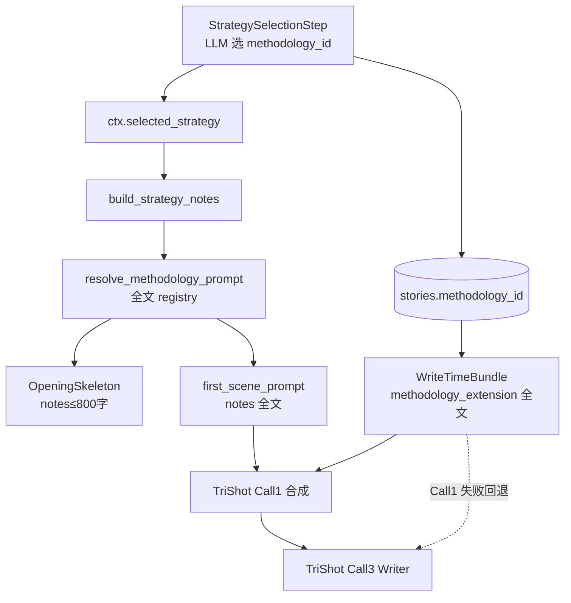

# StoryForge「创作方法论」在创世过程中的应用审计报告

> **审计日期：** 2026-07-09  
> **代码基线：** 工作区当前 master 线（含 v0.26.28+ 策略前移、v0.26.44 开篇骨架、v0.26.46 题材画像 ensure 进行中）  
> **范围：** 方法论资产目录 → StrategySelector 选择 → Genesis quick/background 注入 → TriShot 首章 Writer → 落库与续写回流  
> **证据标签：** executed = 跑过命令；inspected = 读代码/模板；assumed = 推断  
> **方法：** 代码路径追踪 + PromptRegistry 模板对照 + 与历史审计文档交叉验证  

**一句话结论：** 方法论在创世 **quick phase 首章路径上已真正生效**（全文经 `build_strategy_notes` → `first_scene_prompt` → TriShot，并经 `WriteTimeBundle` 双通道注入）；但 **background 五步在 v0.26.28 提示词外部化后静默断链**（代码仍传 `strategy_notes`，外部化 `.md` 无占位符），且 **多步方法论（雪花 2–10 / HDWB 2–4）在创世中从未推进**，存在 **ID 命名分裂** 与 **DB 推荐字段未消费**。

---

## 0. 执行摘要

| 维度 | 评级 | 说明 |
|------|------|------|
| 资产完备性 | B+ | 5 种方法论、19 条 prompt 文件齐全；2 条废弃/未接线 |
| 创世选择质量 | B- | LLM 必选一个 methodology_id；题材推荐仅启发式文本，不读 DB |
| Quick phase 注入 | A- | 骨架/首章均注入；骨架截断 800 字；首章全文 + Bundle 双通道 |
| Background 注入 | **D** | 代码调用 notes，外部化模板丢弃 → **运行时方法论对世界/大纲/角色/场景/伏笔无效** |
| 步进/阶段推进 | **F** | `methodology_step` 创世恒 `None`；永远 step1/seed |
| ID / UI 一致性 | C- | `world_building` vs `high_density_world_building` 分裂 |
| 文档与代码对齐 | C | 多处仍写「策略在后台」；部分计划文档已过时 |
| 测试覆盖 | C | Selector/资产有测；无「background 模板含 strategy」契约；无端到端方法论注入断言 |

**若目标是「创世全链路真正按方法论创作」：** 优先修 background 模板占位符回归（P0），再统一 ID 与步进策略（P1），最后再谈「方法论驱动的分阶段创世」（P2）。

---

## 1. 资产盘点（inspected）

### 1.1 五种方法论

定义：`src-tauri/src/domain/methodology.rs`

| 变体 | Canonical ID（Strategy / Genesis） | 中文名 | Prompt 形态 |
|------|-------------------------------------|--------|-------------|
| `Snowflake` | `snowflake` | 雪花写作法 | 10 步：`methodology_snowflake_step1`…`step10` |
| `SceneStructure` | `scene_structure` | 场景结构规范 | 单文件 `methodology_scene_structure` |
| `HeroJourney` | `hero_journey` | 英雄之旅 | 单文件 `methodology_hero_journey` |
| `CharacterDepth` | `character_depth` | 人物深度模型 | 单文件 `methodology_character_depth` |
| `HighDensityWorldBuilding` | `high_density_world_building` | 高密度世界构建法 | 4 阶段：seed / expansion / convergence / iteration |

资产目录入口：`strategy/asset_catalog.rs::methodology_assets()` → `SelectableAsset`，id 形如 `methodology.snowflake`。

### 1.2 Prompt 文件（`resources/prompts/methodology/`，19 个）

| 状态 | 文件 |
|------|------|
| **Active（Engine / Genesis resolve）** | snowflake×10、hero_journey、scene_structure、character_depth、hdwb×4 |
| **未接线** | `methodology_character_analysis.md`（无 Engine 引用） |
| **已废弃** | `methodology_scene_self_check.md`（frontmatter 自述未接入） |

体量：单文件约 0.4–1.0 KB；合计约 11 KB。雪花 step1 示例（inspected）：

```10:17:resources/prompts/methodology/methodology_snowflake_step1.md
雪花写作法 - 第1步：一句话故事
请用一句话概括整个故事，包含：
- 故事主角（1-2个形容词 + 身份）
- 主角的目标
- 阻碍主角的对抗力量
- 一句话必须有戏剧性张力
```

### 1.3 `MethodologyEngine` 职责

`creative_engine/methodology/mod.rs`：

- `build_prompt_extension(config, pool)`：按 `MethodologyConfig` + `current_step` 返回 system prompt 扩展。
- `list_available()`：返回 5 种类型。
- **主要消费路径（非 Genesis 专属）**：Pro Writer（`agents/service.rs`）、续写 `WriteTimeBundle`、Inspector 动态 prompt。
- `Methodology::output_schema()`：**全库零调用**（死接口）。

### 1.4 ID 分裂（P1 缺陷）

| 路径 | HDWB 使用的 ID |
|------|----------------|
| StrategySelector / asset_catalog / Genesis `resolve_methodology_prompt` / WriteTimeBundle | `high_density_world_building` |
| 设置页 `MethodologySettings.tsx` | `world_building` |
| Pro Writer `build_writer_prompt` 映射 | `world_building` → `HighDensityWorldBuilding` |
| Inspector / 部分 helper | `high_density_world_building` 或 `hdwb` |

**后果（inspected）：**

- Genesis LLM 选出 `high_density_world_building` → 设置页可能显示未选中。
- 用户在设置页选 `world_building` → Genesis `resolve_methodology_prompt` 返回 `None` → `build_strategy_notes` **只写入 ID 字符串，无方法论正文**。

---

## 2. 创世流水线中的位置（inspected）

### 2.1 当前 quick / background 顺序

```464:484:src-tauri/src/narrative/genesis.rs
// quick_phase_steps（v0.26.28+ 策略已前移；v0.26.44 骨架；v0.26.46 ensure）:
ConceptGenerationStep
→ EnsureGenreProfileStep          // 无方法论
→ StrategySelectionStep           // ★ 选择 methodology_id
→ OpeningSkeletonStep             // 注入 strategy_notes（截断 800）
→ FirstChapterGenerationStep      // 注入 strategy_notes（全文）→ TriShot

// background_steps:
ParallelWorldOutlineCharacterStep // 代码传 notes，模板丢弃
→ SceneGenerationStep
→ ForeshadowingGenerationStep
→ KnowledgeGraphGenerationStep    // 无 LLM / 无方法论
→ ContractSeedingStep             // 无方法论
```

**文档漂移：** `sf-architecture-contract` / `sf-genesis-campaign` / 部分 `docs/plans` 仍写「策略在 background、首章拿不到方法论」——**已被 v0.26.28 代码 supersede**。以 `genesis.rs` 与 `docs/AUDIT_BACKSTAGE_STUDIO_v0.26.34.md` 为准。

### 2.2 端到端数据流（首章）



---

## 3. 选择路径审计（inspected）

### 3.1 `StrategySelector::select_strategy`

文件：`src-tauri/src/strategy/selector.rs`

| 步骤 | 对 methodology 的影响 |
|------|----------------------|
| 1. `exact_genre_match` | **只**填 `genre_profile_id`，不预填 methodology |
| 2. GenreResolver 模糊匹配 | 同上，只改 genre |
| 3. LLM `strategy_select` | **要求恰好选一个** `methodology_id`（资产目录 5 项） |
| 4. `merge_strategies` | LLM 的 methodology 覆盖空预匹配 |
| 5. 用户 overrides | Genesis 传 `None` |

**结论：** 创世方法论选择 = **纯 LLM + 资产菜单**；无规则精确匹配方法论。

### 3.2 辅助信号（弱）

| 信号 | 是否进 Genesis | 说明 |
|------|----------------|------|
| `get_genre_recommendations(genre_hint)` | 是（进 selector fallback prompt） | 硬编码：末世→hero_journey、修仙→snowflake、都市→scene_structure… |
| `genre_profiles.recommended_methodology_id` | **否** | 仅 `build_selected_strategy`（续写/orchestrator）在 story 无 methodology 时回退读取 |
| `SelectionContext.methodology_hint` | **否** | Genesis 构造时 `..Default`，恒 `None` |
| GenreProfile → SelectableAsset payload | **不含** recommended_methodology | LLM 看不到 DB 推荐字段 |
| `templates/genres.json` | **无** recommended_methodology 字段 | 种子靠 `lib.rs::seed_genre_recommendations` 对 6 个题材名 UPDATE |

种子映射（`lib.rs:302-338`，仅当 `recommended_style_dna_ids IS NULL`）：

| 题材 | recommended_methodology_id |
|------|---------------------------|
| 末世流 / 科幻 | `hero_journey` |
| 修仙 / 历史 | `snowflake` |
| 都市 / 悬疑 | `scene_structure` |

**缺口：** 军事、谍战、言情、系统流等多数题材 **无种子推荐**；EnsureGenreProfile 新建画像也不写该字段。

### 3.3 持久化

| 字段 | Genesis 行为 |
|------|--------------|
| `stories.methodology_id` | StrategySelectionStep `update` 写入 LLM 结果 |
| `stories.methodology_step` | **显式写 `None`**（`genesis.rs` StrategySelection / Ensure 路径） |
| `ctx.selected_strategy` | 内存持有完整 `SelectedStrategy`（含 methodology_id、四元组等） |

---

## 4. 注入路径审计（按步骤）

### 4.1 核心函数 `build_strategy_notes` / `resolve_methodology_prompt`

```351:396:src-tauri/src/narrative/genesis.rs
// 展开 GenreProfile 全文（基调/节奏/反套路/参考表/结构）
// + 方法论：resolve_methodology_prompt(id, None) → 全文
// + style_dna_ids / skill_ids：仅 ID 列表，不展开正文
```

`resolve_methodology_prompt`：`step` 恒 `None` → 雪花永远 step1，HDWB 永远 seed。

### 4.2 Quick phase 逐步矩阵

| 步骤 | 选择 | 持久化 | 注入方法论正文 | 备注 |
|------|:----:|:------:|:--------------:|------|
| ConceptGeneration | ✗ | methodology=None 建 story | ✗ | 在策略之前 |
| EnsureGenreProfile | ✗ | 不碰 methodology | ✗ | 题材画像 match-or-create |
| StrategySelection | ✓ LLM | id✓ / step✗ | — | 选择点 |
| OpeningSkeleton | — | — | ⚠️ 截断 800 字 | `prompts.rs` `take(800)` |
| FirstChapter | — | — | ✓ 全文 | `narrative_first_scene_generate` 有 `{{strategy_notes}}` |

### 4.3 FirstChapter → TriShot 双通道（inspected）

| 通道 | 内容形态 | 进入 Writer 的方式 |
|------|----------|-------------------|
| A. `task.input` = `first_scene_prompt` | `【创作策略】` + 方法论全文 + 四元组 + 戏剧槽 | Call1 `instruction` → 合成 `final_prompt` |
| B. `WriteTimeBundle.methodology_extension` | `【创作方法论（标签）】` + 同 registry 全文 | Call1 manifest（80 字摘要）+ fallback `bundle_prompt`；可选 Call3 system ≤500 字 |

**潜在重复：** 成功路径上方法论可能同时出现在 user `final_prompt` 与 system guidance（500 字截断版）。

**已知缺口：** Genesis **不**设置 `task.parameters["narrative_quartet"]`；四元组只在 `task.input` 内。Call1 失败回退到 `bundle_prompt` 时，可能丢失 first_scene 戏剧槽，但方法论仍在 Bundle 中。

### 4.4 Background 逐步矩阵 — **P0 断链**

| 步骤 | 代码是否 `build_strategy_notes` | 外部化 `.md` 是否有占位符 | 运行时效果 |
|------|:------------------------------:|:------------------------:|------------|
| World / Outline / Character | ✓ | **无** `strategy_section` | **方法论被静默丢弃** |
| Scene | ✓ | **无** | **丢弃** |
| Foreshadowing | ✓ | **无** | **丢弃** |
| KnowledgeGraph | ✗ | — | 无 LLM |
| ContractSeeding | ✗ | — | 无方法论 |

证据（inspected）：

- Rust fallback（`prompts.rs`）含 `{{strategy_section}}` / `{{quartet_section}}` 与「必须遵循【创作策略参考】中的…方法论」。
- 外部化文件 `narrative_world_building_generate.md` / `outline` / `character` / `scene` / `foreshadowing`（均为 v0.26.28）**variables 列表无 strategy**，正文无占位符。
- `resolve_and_render`：registry 命中则用 `.md`；未声明变量被忽略 → **生产环境走外部化路径时 background 方法论恒空**。

这是相对 `docs/CREATIVE_ASSETS_AUDIT_v0.22.4.md`（当时称 background 未调用 notes）的**状态翻转**：代码已修，**模板回归**把效果又抹掉。

### 4.5 OpeningSkeleton 截断风险

`opening_skeleton_prompt` 对 `strategy_notes` **硬截断 800 字符**。典型 notes = 体裁画像全文（常 >1KB）+ 方法论全文（0.5–1KB）→ **方法论段落经常被截在画像之后，骨架步实际看不到方法论**。首章路径无此截断。

---

## 5. 与续写 / 设置页的衔接（inspected）

| 场景 | 方法论来源 | 步进 |
|------|------------|------|
| Genesis 首章 | `selected_strategy` + DB（刚写入） | 恒 step1/seed |
| 续写 TimeSliced | `WriteTimeBundle` 读 `story.methodology_id` | `methodology_step.unwrap_or(1)` |
| Pro Writer | `MethodologyEngine`（认 `world_building`） | 用户设置 |
| 设置页 | 用户手选 | 可改 step；**创世不会自动推进** |

**创世完成后：** 故事带着 `methodology_id`，但 `methodology_step` 为空 → 续写永远从第 1 步/种子阶段读 prompt，**雪花法「十步递进」产品承诺在创世→续写链上未兑现**。

---

## 6. 历史审计对照（文档债务）

| 文档主张 | 当前代码现实 | 判定 |
|----------|--------------|------|
| v0.22.4：background 未调 `build_strategy_notes` | 已调用 | **已修复（代码）** |
| v0.22.4：notes 只打 methodology_id 不展开 | 已 `resolve_methodology_prompt` 展开全文 | **已修复** |
| 「策略在 background，首章无方法论」 | 策略在 quick phase 第 3 步 | **文档过时** |
| 「首章质量退化因缺策略」战役 | 策略已注入；剩余问题是截断/双通道/background 断链 | **战役目标需重定义** |
| Settings 写 methodology 但业务不处理 | 续写 Bundle / Pro Writer 会读；Genesis 不读 step | **部分过时** |

---

## 7. 缺陷分级与修复建议

### P0 — 必须修（行为错误 / 静默失效）

1. **Background 外部化模板补回 `strategy_section` / `quartet_section`**  
   - 文件：`narrative_{world_building,outline,character,scene,foreshadowing}_generate.md`  
   - 与 Rust fallback 对齐；加契约测试：渲染结果必须含「创作策略参考」或方法论关键词。  
   - 否则世界观/大纲/角色与首章方法论约束 **永久脱节**。

2. **契约测试锁定「registry 模板变量 ⊇ 代码传入 vars」**  
   - 防止再次外部化时丢占位符。

### P1 — 应修（一致性 / 可观测）

3. **统一 HDWB ID**：全栈只用 `high_density_world_building`，设置页与 Pro Writer 映射兼容旧 `world_building`。  
4. **OpeningSkeleton 截断策略**：先截画像再保留方法论摘要，或分字段传「方法论短摘要」而非整包 800 字。  
5. **StrategySelector 消费 `recommended_methodology_id`**：精确/模糊命中题材后预填 methodology，LLM 可覆盖；payload 带上推荐。  
6. **Genesis 写 `methodology_step = 1`（或 `"seed"`）** 而非 `None`，避免下游歧义。  
7. **可观测日志**：StrategySelection 完成后打 `methodology_id` + prompt_id + notes_len；FirstChapter 打 notes 是否含「应遵循的方法论」。

### P2 — 产品增强（需设计门控）

8. **分阶段方法论创世**：若选雪花，Concept≈step1、Outline≈step2–4、Character≈step3、Scene≈step8…（需产品定义，不可静默改用户契约）。  
9. **HDWB 与 ParallelWorld 对齐**：世界构建步强制/优先 HDWB seed→expansion。  
10. **StyleDNA / Skill 正文展开**：与方法论同级注入，避免「只见 ID」。  
11. **减少 TriShot 双通道重复**：Call3 system 的 500 字 methodology guidance 与 user notes 去重。

### P3 — 清理

12. 删除或正式接线 `methodology_character_analysis` / `methodology_scene_self_check`。  
13. 更新 `sf-genesis-campaign` / `sf-architecture-contract` 弱点段：策略前移已完成；新弱点改为 background 模板断链 + step 未推进。  
14. `Methodology::output_schema` 实现或删除。

---

## 8. 验证清单（若实施修复）

```bash
# 模板变量契约（建议新增）
rg -n 'strategy_section|strategy_notes' resources/prompts/creation/narrative_*_generate.md

# 单元
cd src-tauri && cargo test --lib strategy:: narrative::genesis:: -- --nocapture

# 手工创世（军事谍战 / 末世 / 修仙）后检查日志与 DB
# - creative_workflow.log：StrategySelection methodology_id
# - stories.methodology_id / methodology_step
# - 后台 world LLM prompt 是否含「应遵循的方法论」或「创作策略参考」
```

成功标准（可证伪）：

- **S1：** background 任一步 LLM prompt 含已选方法论正文关键词（executed）。  
- **S2：** 设置页选 HDWB 与 Genesis 选出的 ID 可互认（executed）。  
- **S3：** OpeningSkeleton 在画像很长时仍保留 ≥1 段方法论指令（executed）。  
- **S4：** 文档不再声称「策略在 background / 首章无方法论」（inspected）。

---

## 9. 总结矩阵

| 阶段 | 选方法论 | 落库 id | 落库 step | 注入正文 | 实际生效 |
|------|:--------:|:-------:|:---------:|:--------:|:--------:|
| Concept / Ensure | ✗ | ✗ | ✗ | ✗ | — |
| StrategySelection | ✓ | ✓ | ✗ | — | 选择成功 |
| OpeningSkeleton | — | — | — | ⚠️≤800 | 常被画像挤掉 |
| FirstChapter / TriShot | — | — | — | ✓ 双通道 | **主生效路径** |
| Background 世界/大纲/角色/场景/伏笔 | 复用 | — | — | 代码✓ 模板✗ | **失效** |
| KG / Contract | ✗ | — | — | ✗ | — |
| 后续续写 | 读 DB | — | 默认 1 | Bundle | 仅 step1/seed |

---

## 10. 证据索引

| 主题 | 路径 |
|------|------|
| Quick/background 顺序 | `src-tauri/src/narrative/genesis.rs` ~464–484 |
| notes / resolve | `genesis.rs` ~351–439 |
| StrategySelection | `genesis.rs` StrategySelectionStep |
| Selector | `src-tauri/src/strategy/selector.rs` |
| 资产目录 | `src-tauri/src/strategy/asset_catalog.rs` |
| WriteTimeBundle | `src-tauri/src/creative_engine/write_time_bundle.rs` ~189–233 |
| 外部化断链模板 | `resources/prompts/creation/narrative_*_generate.md`（world/outline/character/scene/foreshadowing） |
| 生效模板 | `narrative_first_scene_generate.md`、`narrative_opening_skeleton.md` |
| 方法论正文 | `resources/prompts/methodology/*` |
| ID 分裂 UI | `src-frontend/src/pages/settings/MethodologySettings.tsx` |
| 推荐种子 | `src-tauri/src/lib.rs` `seed_genre_recommendations` |
| 历史审计 | `docs/CREATIVE_ASSETS_AUDIT_v0.22.4.md` |

---

_报告结束。未改业务代码；本文件为审计产物。_
